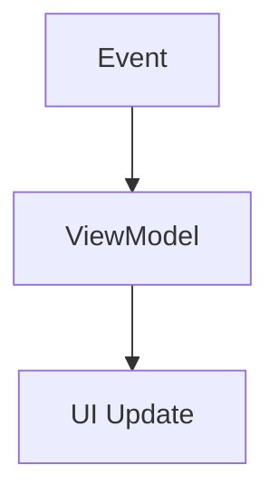
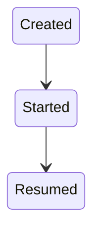

# Android Cheatsheet Generator

## Overview

This skill generates **short Android study cheatsheets** designed for **quick interview review**.

The cheatsheet should:

* highlight high-signal knowledge
* avoid long explanations
* be easy to read in 3–5 minutes
* include diagrams and tables

**Target length:** 300–600 words.

---

# Output Structure

Follow this exact order.

---

## Title

```
Android <Topic> Cheatsheet
```

Example:

```
Android ViewModel Cheatsheet
```

---

## Concept Summary

Explain the concept using **3–5 bullet points**.

Example:

```
• ViewModel stores UI-related data
• Survives configuration changes
• Lifecycle-aware component
• Works well with LiveData or StateFlow
```

---

## Diagram

Include one **Mermaid diagram** illustrating the concept.

Example:



Keep diagrams simple.

---

## Key APIs

List important classes, functions, or callbacks.

Example:

| API              | Purpose                       |
| ---------------- | ----------------------------- |
| ViewModel        | survives configuration change |
| LiveData         | lifecycle-aware observable    |
| SavedStateHandle | restore process-death state   |

---

## Interview Questions

Include **3 concise questions**.

Example:

```
What problem does ViewModel solve?

Why should LiveData be observed with viewLifecycleOwner?

When should SavedStateHandle be used?
```

---

## Common Pitfalls

Highlight mistakes developers often make.

Example:

```
⚠️ Holding fragment view references in ViewModel
⚠️ Observing LiveData with Fragment instead of viewLifecycleOwner
```

Explain briefly if needed.

---

## Quick Reference Table

Example:

| Scenario                 | Recommended Tool |
| ------------------------ | ---------------- |
| Survive rotation         | ViewModel        |
| Lifecycle-aware observer | LiveData         |
| Process death recovery   | SavedStateHandle |

---

# Diagram Rules

Use **Mermaid diagrams only**.

Never use ASCII diagrams.

Example:



---

# Writing Style

The cheatsheet should be:

* concise
* bullet-heavy
* high-signal
* optimized for interview preparation

Avoid long explanations.
