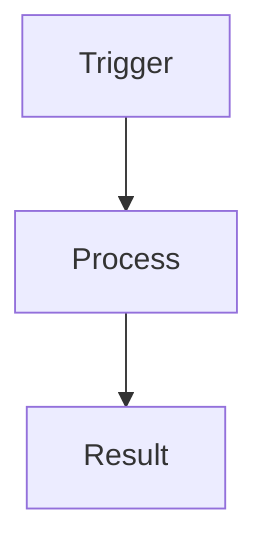
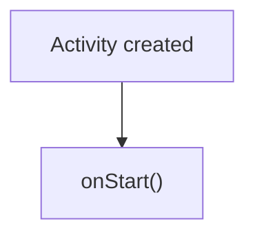

# Android Interview Blog Generator

## Overview

This skill generates **long-form Android technical blog posts** designed for **Android interview preparation**.

The generated article must:

* be technically accurate
* follow a clean Markdown structure
* be optimized for reading on a **Jekyll Chirpy blog**
* include **Mermaid diagrams**, tables, and annotated code
* help readers quickly review concepts before interviews

**Target length:** 1200–2000 words.

---

# Site Context

| Property            | Value                 |
| ------------------- | --------------------- |
| Jekyll theme        | `jekyll-theme-chirpy` |
| Post directory      | `_posts/android/**`   |
| Default language    | English               |
| Table of contents   | Enabled globally      |
| Mermaid diagrams    | Supported             |
| Syntax highlighting | Rouge                 |

---

# Front Matter Template

Every generated post MUST begin with:

```yaml
---
title: "<Descriptive Title>"
description: "<Short summary of the topic>"
date: YYYY-MM-DD 00:00:00
categories: [Android]
tags: [tag1, tag2, tag3]
---
```

### Rules

**Title**

Must clearly describe the concept.

Example:

```
Android Activity Launch Modes Explained
```

**Description**

1–2 sentence summary describing what the reader will learn.

Example:

```
Understand how Android launch modes affect task and back stack behavior.
```

**Tags**

* lowercase
* specific
* hyphen-separated if needed

Example:

```
activity
launch-mode
task
back-stack
```

Do NOT include `layout: post`.

---

# Post Structure

Follow this exact section order.

---

## 1. Introduction

Explain:

* what the topic is
* why Android developers should understand it
* why it frequently appears in technical interviews

Keep the introduction concise.

---

## 2. Concept Overview

Explain the core concept in simple terms.

Prefer:

* short paragraphs
* bullet lists
* simple examples

---

## 3. Flow / Architecture Diagram

Include a **Mermaid diagram** explaining the concept visually.

Example:



Use diagrams for:

* lifecycles
* architecture flows
* rendering pipelines
* callback ordering

---

## 4. Key Concepts

Explain the most important APIs, behaviors, or callbacks.

Use:

* bullet lists
* small tables
* annotated code snippets

Example:

| API          | Purpose                      |
| ------------ | ---------------------------- |
| `onCreate()` | Initial activity setup       |
| `onStart()`  | Activity becomes visible     |
| `onResume()` | Activity becomes interactive |

---

## 5. When to Use in Real Apps

Explain **real-world scenarios** where the concept is used.

Example:

| Scenario                             | Recommended approach |
| ------------------------------------ | -------------------- |
| Prevent duplicate activity instances | `singleTop`          |
| Ensure single instance in task       | `singleTask`         |

Focus on **practical usage**, not theory.

---

## 6. Comparison Table (if applicable)

Include when multiple variants exist.

Example:

```markdown
## 📊 Comparison

| Feature | Option A | Option B |
|---|---|---|
| Behavior | ... | ... |
```

Typical use cases:

* lifecycle callbacks
* launch modes
* architecture components
* API alternatives

---

## 7. Common Interview Questions

Include **3–5 questions** interviewers commonly ask.

Example:

```
What is the difference between onPause() and onStop()?
```

Answers must be:

* concise
* technically correct
* focused on key concepts

---

## 8. Common Mistakes / Pitfalls

Highlight typical developer mistakes.

Example:

```
⚠️ Holding a Fragment view reference after onDestroyView()
⚠️ Performing heavy work inside onPause()
```

Explain **why the issue happens**.

---

## 9. Best Practices

List recommended patterns.

Example:

```
✅ Use ViewModel to survive configuration changes
✅ Observe LiveData with viewLifecycleOwner
```

---

## 10. Quick Cheatsheet

Provide a quick reference table.

Example:

| Scenario                | Recommended API |
| ----------------------- | --------------- |
| UI becomes visible      | onStart         |
| UI becomes interactive  | onResume        |
| Fragment view destroyed | onDestroyView   |

---

## 11. Summary

End the article with:

```
## Summary

Key takeaways:

- concept 1
- concept 2
- concept 3
```

---

## 12. Reference

List out all researched documents and articles that help you creat this blog
- document 1
- document 2
- ...

# Interview Signal

Highlight topics that interviewers frequently test:

* lifecycle ordering
* differences between APIs
* internal Android behaviors
* common production bugs

These should be emphasized clearly in the article.

---

# Diagram Rules (CRITICAL)

All diagrams MUST use **Mermaid**.

Never use:

* ASCII diagrams
* tree characters (`├──`, `└──`)
* plain text arrows

---

## Recommended Diagram Types

| Diagram         | Use Case              |
| --------------- | --------------------- |
| flowchart TD    | sequential flows      |
| flowchart LR    | architecture diagrams |
| stateDiagram-v2 | lifecycle states      |
| sequenceDiagram | callback interactions |
| mindmap         | concept summaries     |

---

## Mermaid Syntax Rules

* Node labels should be **short (max ~40 characters)**.
* Use `<br>` for line breaks.
* Quote labels containing special characters.

Example:



---

# Code Example Rules

Always specify the language:

```
kotlin
xml
yaml
```

Annotate good and bad patterns.

Example:

```kotlin
// ✅ Correct
viewModel.data.observe(viewLifecycleOwner)

// ❌ Incorrect
viewModel.data.observe(this)
```

Code examples must be:

* minimal
* realistic
* focused on the concept

---

# Source Priority

When researching a topic, prioritize:

1. **developer.android.com**
2. official Android documentation / AOSP
3. reputable engineering blogs

Avoid relying primarily on random Medium articles.

---

# File Naming Convention

```
_posts/android/YYYY-MM-DD-topic-name.md
```

Example:

```
_posts/android/2026-03-09-android-activity-launch-modes.md
```

Rules:

* lowercase
* kebab-case
* use today's date

---

# Generation Workflow

When generating a blog post:

1. Research the topic
2. Identify important concepts and interview questions
3. Plan diagrams and tables
4. Generate the article following the structure
5. Validate:

* Mermaid syntax
* correct front matter
* correct directory
* correct date
