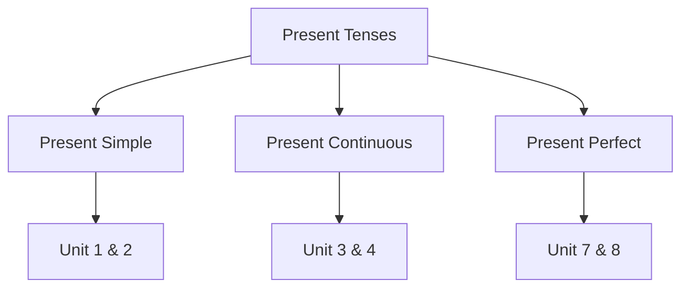

# English Grammar in Use — Topic Summary Generator

## Overview

This skill generates **structured grammar topic summaries** based on the book  
**_English Grammar in Use_ by Raymond Murphy**.

Instead of grouping units by sequential number, this skill **groups units by grammar topic** — a single post covers all units that belong to the same topic (e.g., all Present Tense units, all Modal Verb units, etc.). This makes content easier to search and review by theme.

Each summary is saved as a **Jekyll Chirpy blog post** in `_posts/english/english-grammar-in-use-book/`.

The generated post must:

* cover all units that belong to the chosen grammar topic
* accurately reflect the grammar rules taught in those units
* use clear, beginner-friendly language
* include form tables, example sentences, and common mistakes for each unit
* be useful for both study and future review
* follow the Jekyll Chirpy blog format

**Target length:** 2000–4000 words (varies by number of units in the topic).

---

# Site Context

| Property            | Value                                         |
| ------------------- | --------------------------------------------- |
| Jekyll theme        | `jekyll-theme-chirpy`                         |
| Post directory      | `_posts/english/english-grammar-in-use-book/` |
| Default language    | English                                       |
| Table of contents   | Enabled globally                              |
| Mermaid diagrams    | Supported                                     |
| Syntax highlighting | Rouge                                         |

---

# Front Matter Template

Every generated post MUST begin with:

```yaml
---
title: "{Grammar Topic}: Units {Unit_List} — English Grammar in Use"
description: "{2–3 sentence summary of what grammar points are covered in this topic.}"
date: YYYY-MM-DD 00:00:00
categories: [English, Grammar]
tags: [grammar, english-grammar-in-use, {grammar-topic-tags}, {unit-tags}]
---
```

### Rules

**Title**

Follow this pattern exactly:

```
Present Tenses: Units 1-7 — English Grammar in Use
```

Or for non-sequential units:

```
Modal Verbs: Units 25, 27, 29-31 — English Grammar in Use
```

**Description**

Summarize what grammar points are taught across all the units in this topic and what the reader will learn.

Example:

```
Explore all Present Tense forms in English — Present Simple, Present Continuous, and Present Perfect — covering their structures, key uses, and how they differ from each other.
```

**Tags**

* lowercase
* hyphen-separated
* always include `grammar` and `english-grammar-in-use`
* add the topic slug (e.g., `present-tenses`, `modal-verbs`)
* add individual unit tags: `unit-1`, `unit-2`, etc.

Example:

```
grammar
english-grammar-in-use
present-tenses
present-simple
present-continuous
unit-1
unit-2
unit-3
```

Do NOT include `layout: post`.

---

# Post Structure

Follow this exact section order.

---

## 1. Introduction

In 3–5 sentences:

* state the grammar topic of the post
* list all units included in this topic post
* explain why this topic matters for English learners
* give a brief overview of how the units relate to each other

Keep it brief and motivating.

---

## 2. Topic Overview (optional Mermaid diagram)

When the topic has multiple sub-concepts that relate to each other (e.g., different tense forms, different modal uses), include a **Mermaid diagram** to show the relationships.

Example for Present Tenses:



Skip this section if the topic is simple and a diagram adds no value.

---

## 3. Unit {N}: {Unit Topic}

*(Repeat this section for every unit in the topic, using `##` for each unit heading and `###` for subsections)*

### Grammar Rule

Explain the grammar rule clearly and concisely.

Prefer:

* short paragraphs
* bullet points
* plain language over linguistic jargon

### Form Table

Always include a **form table** showing the grammatical structure.

Example for Present Simple:

| Subject             | Positive | Negative     | Question      |
| ------------------- | -------- | ------------ | ------------- |
| I / You / We / They | work     | don't work   | Do you work?  |
| He / She / It       | works    | doesn't work | Does she work?|

### Key Examples

Provide **6–10 example sentences** that illustrate the grammar rule.
Group them by positive, negative, and question forms when relevant.

### When to Use

Explain the **specific situations** where this grammar rule applies.
Use a table when multiple use cases exist.

### Common Mistakes

Highlight the mistakes learners typically make with this grammar point.

Format:

```
❌ She don't like coffee.
✅ She doesn't like coffee.
```

### Comparison (if applicable)

Include when the unit contrasts two similar grammar points (e.g., Present Simple vs. Present Continuous).

---

## 4. Unit {M}: {Next Unit Topic}

*(Repeat the subsections: Grammar Rule, Form Table, Key Examples, When to Use, Common Mistakes, Comparison; continue for all units in this topic)*

---

## 5. Topic Comparison Table

When the topic contains multiple related grammar points, end with a **comparison table** that shows the key differences at a glance.

Example for Present Tenses:

| Tense              | Use                              | Signal Words              |
| ------------------ | -------------------------------- | ------------------------- |
| Present Simple     | Habits, facts, routines          | always, usually, every    |
| Present Continuous | Actions happening now / temporary | now, at the moment, today |
| Present Perfect    | Past action with present result  | just, already, yet, ever  |

Skip this section if the units do not contrast different grammar points.

---

## 6. Quick Summary

End the post with a concise bullet-point recap for all units covered.

Format:

```markdown
## 📝 Quick Summary

**Unit {N} — {Topic}:**
- Use [grammar point] to [main use case].
- Don't forget: [one key reminder].

**Unit {M} — {Topic}:**
- Use [grammar point] to [main use case].
- Don't forget: [one key reminder].

*(Repeat for all units in this topic)*
```

---

# Writing Style

The post should be:

* **clear and simple** — written for intermediate English learners
* **example-driven** — examples first, theory second
* **concise** — no unnecessary padding
* **encouraging** — supportive tone suitable for self-study

Avoid heavy linguistic terminology. Prefer plain explanations.

---

# File Naming Convention

```
_posts/english/english-grammar-in-use-book/YYYY-MM-DD-grammar-in-use-{topic-slug}.md
```

Example:

```
_posts/english/english-grammar-in-use-book/2026-04-14-grammar-in-use-present-tenses.md
```

Rules:

* lowercase
* kebab-case
* use today's date
* use the topic slug (not unit numbers) as the identifier
* the topic slug should be descriptive: `present-tenses`, `modal-verbs`, `conditionals`, etc.

---

# Generation Workflow

When generating a topic summary:

1. Identify the **grammar topic** and all units that belong to it
2. Research the grammar rules thoroughly for all units in the topic
3. Plan the Mermaid diagram (if applicable), form tables, and example sentences
4. Write the post following the structure above, covering all units in the topic
5. Validate:
   * correct front matter format, topic and all unit numbers reflected accurately
   * form tables are accurate and present for each unit
   * examples are grammatically correct
   * Topic Comparison Table is included when multiple grammar points are contrasted
   * correct directory: `_posts/english/english-grammar-in-use-book/`
   * correct date and topic slug in filename
