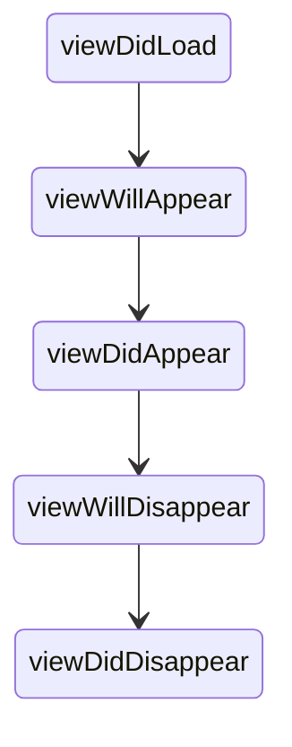
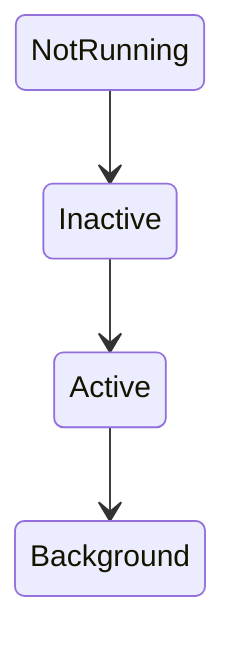

# iOS Cheatsheet Generator

## Overview

This skill generates **short iOS study cheatsheets** designed for **quick topic review**.

The cheatsheet should:

* highlight high-signal knowledge
* avoid long explanations
* be easy to read in 3–5 minutes
* include diagrams and tables

**Target length:** 300–600 words.

---

# Site Context

| Property            | Value                              |
| ------------------- | ---------------------------------- |
| Jekyll theme        | `jekyll-theme-chirpy`              |
| Post directory      | `_posts/ios-learning/cheatsheet/`  |
| Default language    | English                            |
| Table of contents   | Enabled globally                   |
| Mermaid diagrams    | Supported                          |
| Syntax highlighting | Rouge                              |

---

# Front Matter Template

Every generated cheatsheet MUST begin with:

```yaml
---
title: "iOS <Topic> Cheatsheet"
description: "<Short summary of the topic>"
date: YYYY-MM-DD 00:00:00
categories: [iOS, Cheatsheet]
tags: [ios, swift, cheatsheet, tag1, tag2]
---
```

### Rules

**Title**

Follow this pattern:

```
iOS ViewModel Cheatsheet
```

**Description**

1 sentence summary of what the cheatsheet covers.

**Tags**

* lowercase
* specific
* hyphen-separated if needed
* always include `ios`, `swift`, and `cheatsheet`

Do NOT include `layout: post`.

---

# File Naming Convention

```
_posts/ios-learning/cheatsheet/YYYY-MM-DD-ios-topic-name-cheatsheet.md
```

Example:

```
_posts/ios-learning/cheatsheet/2026-03-13-ios-view-lifecycle-cheatsheet.md
```

Rules:

* lowercase
* kebab-case
* use today's date

---

# Output Structure

Follow this exact order.

---

## Title

```
iOS <Topic> Cheatsheet
```

Example:

```
iOS View Lifecycle Cheatsheet
```

---

## Concept Summary

Explain the concept using **3–5 bullet points**.

Example:

```
• UIViewController manages a view hierarchy
• viewDidLoad() is called once after the view is loaded into memory
• viewWillAppear() is called every time the view is about to become visible
• viewDidDisappear() is the place to stop animations or timers
```

---

## Diagram

Include one **Mermaid diagram** illustrating the concept.

Example:



Keep diagrams simple.

---

## Key APIs

List important classes, protocols, or methods.

Example:

| API                  | Purpose                            |
| -------------------- | ---------------------------------- |
| viewDidLoad()        | initial setup, called once         |
| viewWillAppear(_:)   | called before view is visible      |
| viewDidDisappear(_:) | called after view is removed       |

---

## Common Interview Questions

Include **3 concise questions**.

Example:

```
What is the difference between viewDidLoad and viewWillAppear?

When should you use viewDidDisappear to clean up resources?

How does the view lifecycle differ between UIKit and SwiftUI?
```

---

## Common Pitfalls

Highlight mistakes developers often make.

Example:

```
⚠️ Doing heavy layout work in viewDidLoad instead of viewDidLayoutSubviews
⚠️ Not calling super in lifecycle methods
```

Explain briefly if needed.

---

## Quick Reference Table

Example:

| Scenario                    | Recommended Method        |
| --------------------------- | ------------------------- |
| One-time setup              | viewDidLoad()             |
| Refresh data on appear      | viewWillAppear(_:)        |
| Stop timers on disappear    | viewDidDisappear(_:)      |

---

# Diagram Rules

Use **Mermaid diagrams only**.

Never use ASCII diagrams.

Example:



---

# Code Example Rules

Always use Swift:

```swift
override func viewDidLoad() {
    super.viewDidLoad()
    // setup code
}
```

Code must be minimal and focused.

---

# Writing Style

The cheatsheet should be:

* concise
* bullet-heavy
* high-signal
* optimized for quick review and learning

Avoid long explanations.
