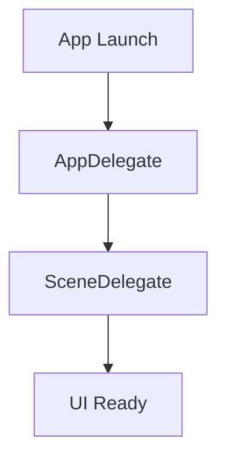
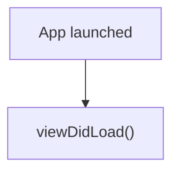

# iOS Topic Summary Blog Generator

## Overview

This skill generates **long-form iOS technical blog posts** designed for **learning and reviewing iOS development topics**.

The generated article must:

* be technically accurate
* follow a clean Markdown structure
* be optimized for reading on a **Jekyll Chirpy blog**
* include **Mermaid diagrams**, tables, and annotated Swift code
* help readers understand and review iOS concepts effectively

**Target length:** 1200–2000 words.

---

# Site Context

| Property            | Value                 |
| ------------------- | --------------------- |
| Jekyll theme        | `jekyll-theme-chirpy` |
| Post directory      | `_posts/ios-learning/`|
| Default language    | English               |
| Table of contents   | Enabled globally      |
| Mermaid diagrams    | Supported             |
| Syntax highlighting | Rouge                 |

---

# Front Matter Template

Every generated post MUST begin with:

```yaml
---
title: "<Descriptive Title>"
description: "<Short summary of the topic>"
date: YYYY-MM-DD 00:00:00
categories: [iOS]
tags: [ios, swift, tag1, tag2]
---
```

### Rules

**Title**

Must clearly describe the concept.

Example:

```
iOS App Lifecycle Explained
```

**Description**

1–2 sentence summary describing what the reader will learn.

Example:

```
Understand how the iOS app lifecycle works, from launch to termination, and how to respond to state transitions.
```

**Tags**

* lowercase
* specific
* hyphen-separated if needed
* always include `ios` and `swift`

Example:

```
ios
swift
app-lifecycle
scene-delegate
app-delegate
```

Do NOT include `layout: post`.

---

# Post Structure

Follow this exact section order.

---

## 1. Introduction

Explain:

* what the topic is
* why iOS developers should understand it
* when this concept is commonly encountered in real apps

Keep the introduction concise.

---

## 2. Concept Overview

Explain the core concept in simple terms.

Prefer:

* short paragraphs
* bullet lists
* simple examples

---

## 3. Flow / Architecture Diagram

Include a **Mermaid diagram** explaining the concept visually.

Example:



Use diagrams for:

* lifecycles
* architecture flows
* data flow pipelines
* delegate callback ordering

---

## 4. Key Concepts

Explain the most important APIs, protocols, or behaviors.

Use:

* bullet lists
* small tables
* annotated code snippets

Example:

| API / Protocol       | Purpose                          |
| -------------------- | -------------------------------- |
| `UIApplicationDelegate` | App-level lifecycle events    |
| `UISceneDelegate`       | Scene-level lifecycle events  |
| `@main`                 | Entry point attribute         |

---

## 5. When to Use in Real Apps

Explain **real-world scenarios** where the concept is used.

Example:

| Scenario                          | Recommended approach       |
| --------------------------------- | -------------------------- |
| Handle push notification on launch | `AppDelegate` method      |
| Restore UI state on foreground     | `SceneDelegate` callback  |

Focus on **practical usage**, not theory.

---

## 6. Comparison Table (if applicable)

Include when multiple variants or alternatives exist.

Example:

```markdown
## Comparison

| Feature        | UIKit          | SwiftUI        |
|----------------|----------------|----------------|
| Entry point    | AppDelegate    | @main App      |
| State mgmt     | Manual         | @State, @Binding |
```

Typical use cases:

* UIKit vs SwiftUI approaches
* delegate vs Combine patterns
* architecture component alternatives

---

## 7. Common Interview Questions

Include **3–5 questions** that are commonly asked about the topic.

Example:

```
What is the difference between AppDelegate and SceneDelegate?
```

Answers must be:

* concise
* technically correct
* focused on key concepts

---

## 8. Common Mistakes / Pitfalls

Highlight typical developer mistakes.

Example:

```
⚠️ Performing heavy work in application(_:didFinishLaunchingWithOptions:)
⚠️ Not handling background-to-foreground transitions properly
```

Explain **why the issue happens**.

---

## 9. Best Practices

List recommended patterns.

Example:

```
✅ Use SceneDelegate for multi-window support on iPadOS
✅ Keep AppDelegate lightweight — delegate work to coordinators
```

---

## 10. Quick Cheatsheet

Provide a quick reference table.

Example:

| Scenario                  | Recommended API          |
| ------------------------- | ------------------------ |
| App first launches        | didFinishLaunchingWithOptions |
| Scene enters foreground   | sceneWillEnterForeground |
| Save state on background  | sceneDidEnterBackground  |

---

## 11. Summary

End the article with:

```
## Summary

Key takeaways:

- concept 1
- concept 2
- concept 3
```

---

## 12. References

List all researched documents and articles used.

- document 1
- document 2
- ...

Prioritize official Apple documentation links.

---

# Diagram Rules (CRITICAL)

All diagrams MUST use **Mermaid**.

Never use:

* ASCII diagrams
* tree characters (`├──`, `└──`)
* plain text arrows

---

## Recommended Diagram Types

| Diagram         | Use Case              |
| --------------- | --------------------- |
| flowchart TD    | sequential flows      |
| flowchart LR    | architecture diagrams |
| stateDiagram-v2 | lifecycle states      |
| sequenceDiagram | delegate interactions |
| mindmap         | concept summaries     |

---

## Mermaid Syntax Rules

* Node labels should be **short (max ~40 characters)**.
* Use `<br>` for line breaks.
* Quote labels containing special characters.

Example:



---

# Code Example Rules

Always specify the language as `swift`:

```swift
// ✅ Correct
class ViewController: UIViewController {
    override func viewDidLoad() {
        super.viewDidLoad()
    }
}
```

Annotate good and bad patterns.

Example:

```swift
// ✅ Correct — use weak self in closures
fetchData { [weak self] result in
    self?.updateUI(result)
}

// ❌ Incorrect — strong reference cycle
fetchData { result in
    self.updateUI(result)
}
```

Code examples must be:

* minimal
* realistic
* written in Swift
* focused on the concept

---

# Source Priority

When researching a topic, prioritize:

1. **developer.apple.com** (official documentation)
2. Apple WWDC session notes and videos
3. Swift.org documentation
4. Reputable engineering blogs (NSHipster, SwiftLee, Hacking with Swift)

Avoid relying primarily on random Medium articles.

---

# File Naming Convention

```
_posts/ios-learning/YYYY-MM-DD-topic-name.md
```

Example:

```
_posts/ios-learning/2026-03-13-ios-app-lifecycle.md
```

Rules:

* lowercase
* kebab-case
* use today's date

---

# Generation Workflow

When generating a blog post:

1. Research the topic
2. Identify important concepts and practical use cases
3. Plan diagrams and tables
4. Generate the article following the structure
5. Validate:

* Mermaid syntax
* correct front matter
* correct directory: `_posts/ios-learning/`
* correct date
