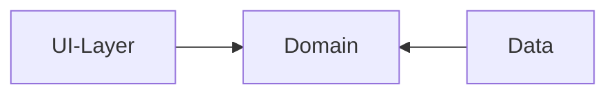

Android Clean Architecture is typically divided into **three layers**: **Presentation**, **Domain**, and **Data**.



## 1. Presentation Layer (UI Layer)

Responsible for rendering the UI and handling user interactions. This layer includes **Activities**, **Fragments**, **Composables**, and **ViewModels**.

- The ViewModel retrieves data by calling Use Cases from the Domain layer.
- It holds and exposes UI state to the UI components.
- This layer should know nothing about data sources or how data is fetched.

## 2. Domain Layer

The **core** of the application. It contains the business logic and rules, independent of any Android framework.

- **Entities** — plain data models representing business concepts.
- **Use Cases** — each encapsulates a single business operation (e.g., `GetUserUseCase`, `LoginUseCase`).
- **Repository Interfaces** — define *what* data operations are needed, without specifying *how*.

This layer is a **pure Kotlin module** — no Android, no Retrofit, no Room dependencies.

## 3. Data Layer

Responsible for providing and persisting data. It implements the repository interfaces defined in the Domain layer.

- **Repository Implementations** — concrete classes that fulfil the domain contracts.
- **Remote Data Sources** — communicate with REST APIs (e.g., via Retrofit).
- **Local Data Sources** — read/write to local storage (e.g., via Room, DataStore).
- **DTOs** — raw models returned by APIs or DBs, mapped to domain entities before passing upward.

## 4. Dependency Rule

> Dependencies can only point **inward**. Outer layers depend on inner layers — never the reverse.

```
Presentation  →  Domain  ←  Data
```

The Domain layer defines interfaces; the Data layer implements them. This keeps the core business logic isolated and independently testable.

## 5. References

- [Guide to app architecture — Android Developers](https://developer.android.com/topic/architecture)
- [Clean Architecture by Uncle Bob](https://blog.cleancoder.com/uncle-bob/2012/08/13/the-clean-architecture.html)
