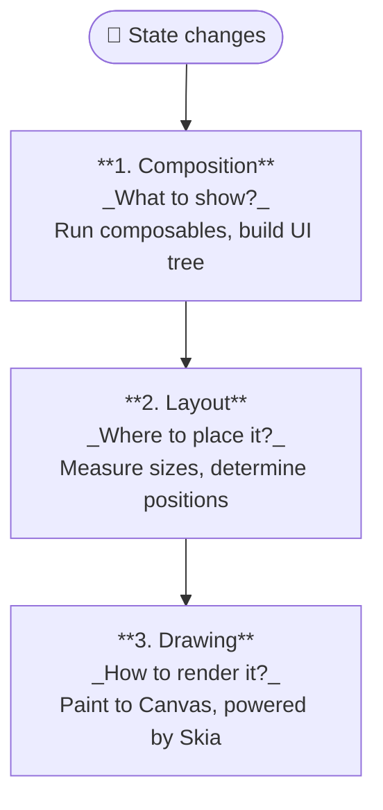
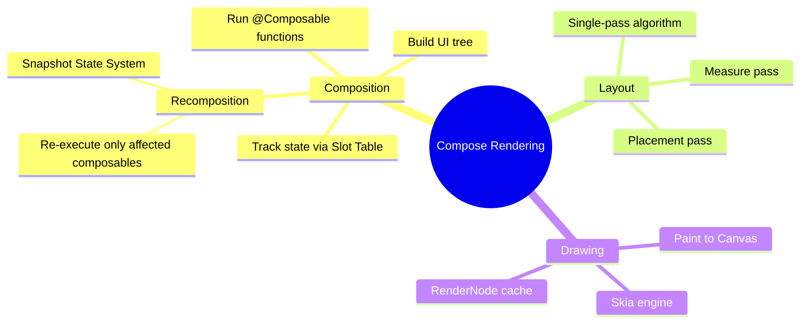

Jetpack Compose renders UI through a **pipeline of 3 sequential phases** that always run in the same order: **Composition → Layout → Drawing**. Compose can intelligently skip a phase when no changes are needed, optimizing performance.

---

## The Three Rendering Phases



---

## Phase 1: Composition — "What to show?"

This is the first phase where Compose determines the **structure of the UI** to display.

- **Executing Composable functions**: Compose runs `@Composable` functions, reading current state and parameters.
- **Building the Composition Tree**: The result is a tree of nodes representing the entire UI structure and element hierarchy.
- **State Read Tracking**: While composables run, Compose records which composable is reading which piece of state (e.g., `mutableStateOf`). When state changes, only the relevant composables are re-executed.
- **Slot Table**: Compose uses an internal data structure called a **Slot Table** to store state, `remember` values, and dependencies between composables and state — enabling it to know exactly what changed.
- **Kotlin Compiler Plugin**: The `@Composable` annotation is processed by a Kotlin compiler plugin that threads a `Composer` object through composable calls to enable smart recomposition and slot management.

> **Note**: Composition only defines the *structure and content* of the UI — it does not handle sizing, positioning, or drawing.

---

## Recomposition — Updating only what changed

**Recomposition** is the process of re-executing composable functions when the state they read changes.

### Snapshot State System

Compose manages state through the **Snapshot State System** — which works similarly to a version control system:

1. When `mutableStateOf` is created, the state becomes **observable**.
2. While a composable runs, the system **tracks** which composable reads which state.
3. When state changes, the system creates a new **snapshot** and marks the affected composables as **invalid**.
4. Compose **only re-executes** the invalidated composables — it does not re-render the entire UI.
5. State changes are processed **transactionally** (in batches) to ensure consistency.

### Recomposition Optimizations

| Feature | Description |
|---|---|
| **Smart Skipping** | Skips composables whose inputs have not changed |
| **Recomposition Scopes** | Each composable creates an independent scope that can update on its own |
| **Optimistic Recomposition** | Composables can run in parallel; recomposition is cancelled and restarted if new state arrives |

---

## Phase 2: Layout — "Where to place it?"

Once Compose knows what to display, the Layout phase determines the **size and position** of each element.

- **Measure Pass**: Each element reports its minimum, maximum, and preferred size requirements.
- **Placement Pass**: Compose calculates the exact X/Y coordinates of each element relative to its parent.
- **Single-Pass Algorithm**: The layout traverses the tree once — each node is measured and placed exactly once, keeping even complex layouts efficient.

---

## Phase 3: Drawing — "How to render it?"

The final phase where Compose **paints elements** onto the screen.

- **Canvas operations**: Compose executes draw calls for colors, shapes, text, images, shadows, borders, and more.
- **Skia Engine**: Compose uses **Skia** — the same high-performance graphics engine used in Flutter and Chrome — to render pixels.
- **RenderNodes**: Compose leverages Android's `RenderNode` to cache drawing commands, reducing CPU work especially during animations and scrolling.
- **Targeted Redrawing**: Only elements marked as **dirty** (whose visual properties changed) are redrawn.
- **Direct Drawing**: Compose draws directly onto a `Canvas` rather than relying on the traditional View system.

---

## Phase Skipping — Compose skips unnecessary phases

Compose does not always run all 3 phases. Depending on the type of change:

| Change | Composition | Layout | Drawing |
|---|---|---|---|
| Text content changes | ✅ | ✅ | ✅ |
| Only color changes | ✅ | ❌ (skip) | ✅ |
| Size changes | ✅ | ✅ | ✅ |
| Nothing changes | ❌ | ❌ | ❌ |

---

## Best Practices to Avoid Unnecessary Recomposition

### 1. Manage State correctly

```kotlin
// ✅ Use remember to persist state across recompositions
val count by remember { mutableStateOf(0) }

// ✅ Use derivedStateOf for computed values
val isValid by remember {
    derivedStateOf { email.isNotEmpty() && email.contains("@") }
}
```

### 2. Ensure Type Stability

```kotlin
// ✅ Mark @Immutable for classes that never change after construction
@Immutable
data class UserProfile(val name: String, val avatar: String)

// ✅ Mark @Stable for classes that change but are observable
@Stable
class CartState {
    var items by mutableStateOf(emptyList<Item>())
}
```

### 3. Use Immutable Collections

```kotlin
// ❌ Regular List → Compose treats it as unstable
val items: List<String> = listOf("a", "b", "c")

// ✅ Use kotlinx.collections.immutable or wrap with @Immutable
val items: ImmutableList<String> = persistentListOf("a", "b", "c")
```

### 4. Provide stable `key`s in lists

```kotlin
LazyColumn {
    items(
        items = userList,
        key = { user -> user.id }  // ✅ Stable key prevents unnecessary recompositions
    ) { user ->
        UserItem(user)
    }
}
```

### 5. Defer State Reads

```kotlin
// ❌ Reading state in the parent causes the parent to recompose
@Composable
fun Parent(scrollState: ScrollState) {
    val offset = scrollState.value  // parent recomposes on every scroll
    Child(offset = offset)
}

// ✅ Pass a lambda to defer the read into the child or modifier
@Composable
fun Parent(scrollState: ScrollState) {
    Child(offsetProvider = { scrollState.value })  // parent no longer recomposes
}
```

---

## Summary



**Key takeaways**:
- The three phases always run in order: Composition → Layout → Drawing.
- Compose **skips** unnecessary phases when there are no relevant changes.
- The **Snapshot State System** is the mechanism that tells Compose exactly which composables need to recompose.
- Use `@Stable`, `@Immutable`, `derivedStateOf`, `remember`, and `key` to optimize recomposition.
