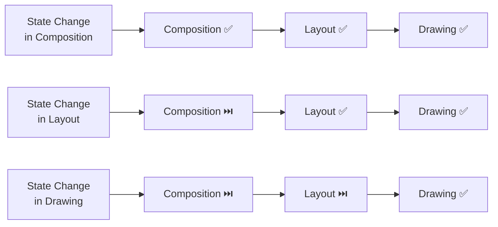

## Android Compose Render Phases Cheatsheet

## Concept Summary

- Compose renders every frame through **3 ordered phases**: Composition → Layout → Drawing
- **Composition** — runs `@Composable` functions, builds the UI node tree (*what* to show)
- **Layout** — single-pass measure + place algorithm, O(n) traversal (*where* to place)
- **Drawing** — traverses tree top-to-bottom, renders each node onto Canvas (*how* to render)
- Compose **skips phases** not affected by a state change
- State reads are tracked **per phase** — the later the read, the fewer phases are re-triggered

---

## Diagram

---

## Key APIs

| API | Phase | Purpose |
|---|---|---|
| `@Composable` / `remember` | Composition | Build & cache UI tree |
| `Layout { }` | Layout | Custom measure & place |
| `Modifier.offset { IntOffset }` | Layout (placement) | Defer position read to Layout |
| `Modifier.offset(Dp)` | Composition | ⚠️ Triggers recomposition |
| `Canvas { }` | Drawing | Custom draw on canvas |
| `Modifier.drawBehind { }` | Drawing | Draw behind composable |
| `Modifier.drawWithContent { }` | Drawing | Draw over composable content |
| `derivedStateOf { }` | Any | Filter unnecessary recompositions |

---

## Interview Questions

**Q1: What are the 3 phases of Compose rendering?**
> Composition (builds UI tree), Layout (measures & places nodes in O(n)), Drawing (renders pixels onto Canvas).

**Q2: Why is `Modifier.offset { }` more performant than `Modifier.offset(Dp)` for scroll animations?**
> The lambda form reads state during the Layout phase — only Layout + Drawing re-trigger. The `Dp` form reads state during Composition, causing full recomposition on every scroll event.

**Q3: What is a recomposition loop?**
> When state is written in Layout (e.g., `onSizeChanged`) and read in Composition. This causes a multi-frame cycle with UI jumping. Fix: use proper layout primitives (`Column`, `Row`, or custom `Layout`).

---

## Common Pitfalls

⚠️ **Reading scroll state during Composition for position offsets** — use `Modifier.offset { }` lambda instead of `Modifier.offset(Dp)`.

⚠️ **Using `onSizeChanged` + `padding`/`height` state** — creates a recomposition loop across frames; use `Column` or a custom layout.

⚠️ **Treating all state changes as equally expensive** — a Drawing-phase state read costs far less than a Composition-phase read.

⚠️ **`BoxWithConstraints`, `LazyColumn`, `LazyRow` are exceptions** — their children's Composition depends on the parent's Layout phase result.

---

## Quick Reference Table

| Scenario | Where to read state | Phases triggered |
|---|---|---|
| Show / hide content | `@Composable` body | Composition + Layout + Drawing |
| Animate position | `Modifier.offset { }` | Layout + Drawing |
| Animate color / alpha | `Modifier.drawBehind` / `Canvas` | Drawing only |
| Scroll parallax effect | `Modifier.offset { }` | Layout + Drawing |
| Filter noisy state changes | `derivedStateOf` | Reduced recompositions |
| Relative layout sizing | Custom `Layout` / `Column` | Avoids recomposition loops |
