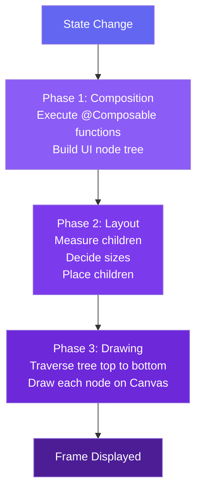
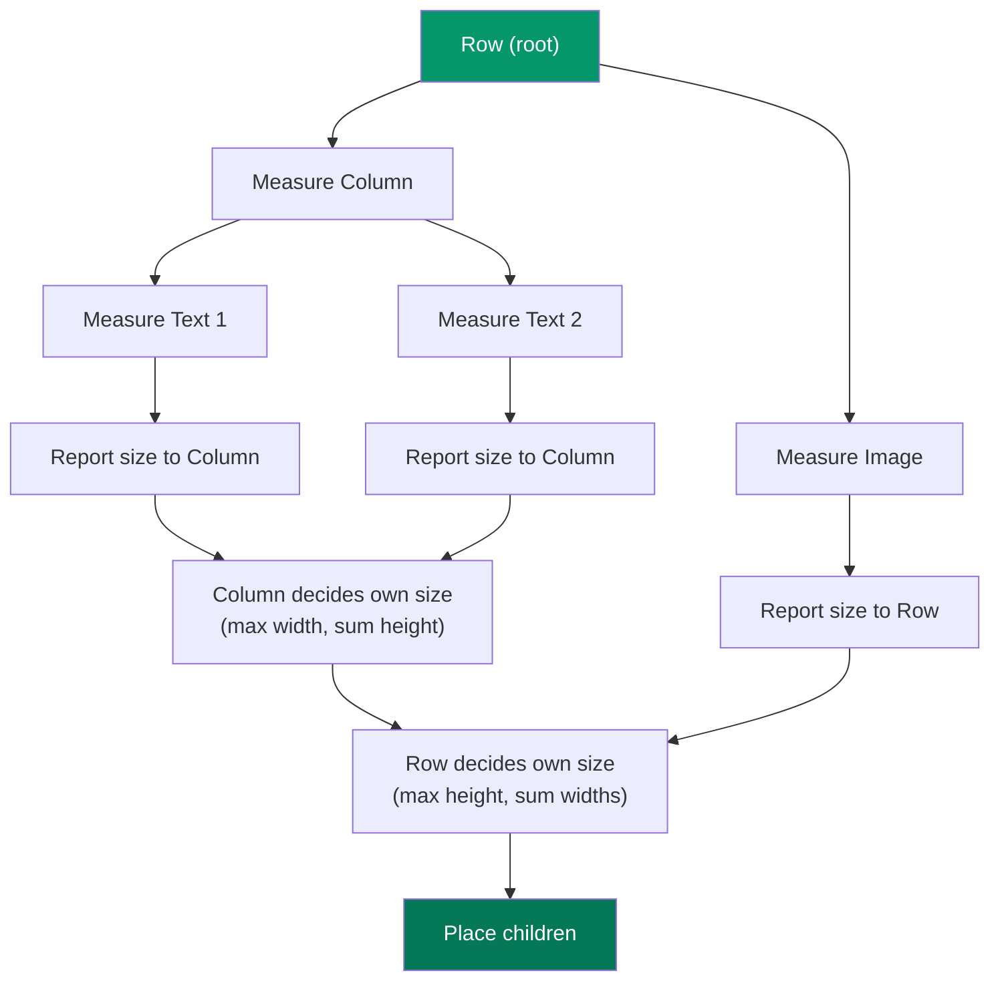
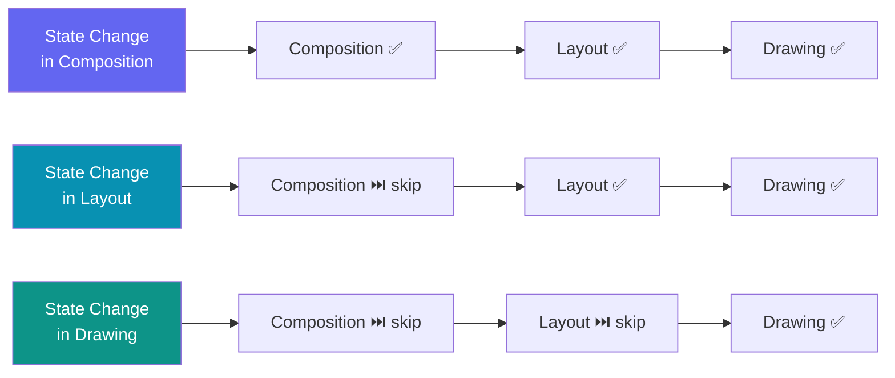

## Introduction

Jetpack Compose renders your UI through a precise, ordered pipeline. Every frame your app produces passes through **three distinct phases**: **Composition**, **Layout**, and **Drawing**. Understanding how these phases work — and how Compose decides to skip or re-run them — is essential for writing performant Compose code and is a very common topic in Android technical interviews.

If you've ever wondered why changing a color feels instant but repositioning an element costs more, or how Compose knows which parts to update, the answer lies in these three phases.

---

## Concept Overview

Each time Compose needs to produce a frame, it executes (when necessary) the following phases in order:

1. **Composition** — *What* to show. Composable functions run and produce a UI tree.
2. **Layout** — *Where* to place elements. Each node is measured and positioned.
3. **Drawing** — *How* to render. Each node paints itself onto the canvas.

Data flows **one direction** through these phases (unidirectional data flow). Compose is smart enough to skip phases that are not needed. For example:

- If only a **color** changes → skip Composition and Layout, only run Drawing.
- If only a **position** changes → skip Composition, only run Layout and Drawing.
- If **content** changes → all three phases run.

This optimization is possible because **Compose tracks exactly where each state is read**.

---

## Flow / Architecture Diagram

### The Three Phases Pipeline



### Layout Phase — Measurement Algorithm



### Phase Skipping Optimization



---

## Key Concepts

### Phase 1: Composition

Compose runs your `@Composable` functions and builds a **UI node tree** that describes what to display. This tree is then fed into the next phase.

- State read inside a `@Composable` function triggers **recomposition** when the state changes.
- Compose may **skip** re-running a composable if its inputs haven't changed (smart recomposition).
- Changing state read during composition will also trigger Layout and Drawing unless Compose can determine nothing else changed.

```kotlin
var padding by remember { mutableStateOf(8.dp) }

Text(
    text = "Hello",
    // State `padding` read during Composition
    // Any change triggers full recomposition
    modifier = Modifier.padding(padding)
)
```

### Phase 2: Layout

The **Layout phase** traverses the UI tree using a **single-pass measurement algorithm** with three steps:

1. **Measure children** — a node asks all its children for their sizes.
2. **Decide own size** — based on children measurements, the node decides its size.
3. **Place children** — each child is positioned relative to the parent.

The single-pass approach keeps traversal time **linear** (O(n)) rather than exponential.

State reads during Layout (e.g., inside `LayoutModifier`, `Modifier.offset { }` lambda) trigger only **Layout and Drawing** on change, skipping Composition.

```kotlin
var offsetX by remember { mutableStateOf(8.dp) }

Text(
    text = "Hello",
    modifier = Modifier.offset {
        // State `offsetX` read during Layout phase (placement step)
        // Changes only re-trigger Layout + Drawing
        IntOffset(offsetX.roundToPx(), 0)
    }
)
```

### Phase 3: Drawing

Compose traverses the tree **top to bottom** and each node renders itself onto the `Canvas`.

State reads inside drawing APIs (e.g., `Canvas()`, `Modifier.drawBehind`, `Modifier.drawWithContent`) trigger only the **Drawing phase** on change.

```kotlin
var color by remember { mutableStateOf(Color.Red) }

Canvas(modifier = modifier) {
    // State `color` read during Drawing phase
    // Changes only re-trigger Drawing
    drawRect(color)
}
```

---

## When to Use in Real Apps

| Scenario | Recommended Approach |
|---|---|
| Animate element **color or alpha** | Read state in `drawBehind` / `Canvas` → Drawing phase only |
| Animate element **position** | Read state in `Modifier.offset { }` lambda → Layout phase only |
| Show/hide entire composable | Read state in composition → Composition + Layout + Drawing |
| Parallax scroll effect | Use `Modifier.offset { }` lambda (Layout), not `Modifier.offset(Dp)` (Composition) |
| Derived or filtered state | Use `derivedStateOf` to avoid unnecessary recompositions |

---

## Comparison Table

| Aspect | Composition | Layout | Drawing |
|---|---|---|---|
| **What it does** | Builds UI tree | Measures & places nodes | Renders pixels |
| **Triggered by** | `@Composable` state reads | `LayoutModifier` state reads | `drawBehind` / `Canvas` state reads |
| **Can be skipped?** | ✅ Yes | ✅ Yes | ✅ Yes |
| **Performance cost** | High (re-runs Kotlin code) | Medium (traverses tree) | Low (GPU-accelerated) |
| **Key APIs** | `@Composable`, `remember` | `Layout`, `Modifier.offset{}` | `Canvas`, `Modifier.drawBehind` |

---

## Common Interview Questions

**Q1: What are the three render phases in Jetpack Compose?**

> **Composition** (builds UI tree by running `@Composable` functions), **Layout** (measures and places each node using a single-pass algorithm), and **Drawing** (renders each node onto the Canvas top to bottom).

**Q2: How does Compose optimize rendering performance?**

> Compose tracks exactly where each state value is read. If a state change only affects the Drawing phase (e.g., a color change), Compose can skip Composition and Layout entirely, running only the Drawing phase.

**Q3: What is the difference between `Modifier.offset(Dp)` and `Modifier.offset { IntOffset }`?**

> `Modifier.offset(Dp)` reads state during **Composition**, causing recomposition on every scroll event. `Modifier.offset { }` (lambda form) reads state during the **Layout** placement step, so only Layout and Drawing are re-triggered — which is significantly more performant for scroll-driven animations.

**Q4: What is a recomposition loop and how does it happen?**

> A recomposition loop occurs when a state is written during the Layout phase (e.g., via `Modifier.onSizeChanged`) and that same state is then read during Composition. This creates a multi-frame cycle: the UI renders incorrectly in the first frame, triggers a recomposition for the second frame, and potentially loops. The fix is to use proper layout primitives (e.g., `Column`, `Row`) or a custom layout that eliminates the need for inter-phase state sharing.

**Q5: Why does the Layout phase use a single-pass measurement algorithm?**

> A single-pass algorithm ensures traversal time scales **linearly** with the number of nodes (O(n)). If each node were visited multiple times (as in older View systems with multiple measurement passes), traversal time would grow exponentially, degrading performance in deep UI hierarchies.

---

## Common Mistakes / Pitfalls

⚠️ **Reading scroll offset in Composition for visual offsets**
```kotlin
// ❌ Reads state during Composition → full recomposition on every scroll
Modifier.offset(
    with(LocalDensity.current) { (listState.firstVisibleItemScrollOffset / 2).toDp() }
)

// ✅ Reads state during Layout → only Layout + Drawing re-triggered
Modifier.offset {
    IntOffset(x = 0, y = listState.firstVisibleItemScrollOffset / 2)
}
```

⚠️ **Using `onSizeChanged` + `padding` to create relative layouts**
- This creates a recomposition loop across multiple frames.
- **Fix**: Use `Column`, `Row`, or write a custom `Layout` composable.

⚠️ **Assuming all state changes are equally expensive**
- A state read in Drawing only triggers Drawing.
- A state read in Composition triggers all three phases.
- Place state reads at the **lowest phase possible**.

⚠️ **Forgetting that `BoxWithConstraints`, `LazyColumn`, and `LazyRow` are exceptions**
- Their children's **Composition depends on the parent's Layout phase** (the layout phase determines which children to compose).
- These break the strict "Composition before Layout" order.

---

## Best Practices

✅ **Defer state reads to the latest possible phase** — prefer Drawing-phase reads over Layout-phase reads, and Layout-phase reads over Composition-phase reads when the logic allows.

✅ **Use the lambda form of `Modifier.offset { }`** for scroll-driven parallax effects instead of the `Dp`-based overload.

✅ **Use `derivedStateOf`** to filter state changes and avoid unnecessary recompositions.

✅ **Prefer layout primitives** (`Column`, `Row`, `Box`, `ConstraintLayout`) over manual `onSizeChanged` + padding patterns.

✅ **Use `Modifier.drawBehind` or `Canvas` for color/alpha animations** to bypass Composition and Layout entirely.

✅ **Profile with Layout Inspector and Composition Tracing** to identify which phases are being triggered and how often.

---

## Quick Cheatsheet

| Scenario | Where state is read | Phases triggered |
|---|---|---|
| Show/hide content | `@Composable` body | Composition → Layout → Drawing |
| Animate position | `Modifier.offset { }` lambda | Layout → Drawing |
| Animate color / alpha | `Modifier.drawBehind` / `Canvas` | Drawing only |
| Scroll-driven parallax | `Modifier.offset { }` lambda | Layout → Drawing |
| Filter state changes | `derivedStateOf` | Reduced recompositions |
| Relative sizing | Use `Column` / custom `Layout` | Avoids recomposition loops |

---

## Summary

Key takeaways:

- Compose renders every frame through three ordered phases: **Composition → Layout → Drawing**.
- **Composition** runs `@Composable` functions and builds a UI node tree.
- **Layout** uses a single-pass algorithm to measure and place each node in O(n) time.
- **Drawing** traverses the tree top to bottom and renders each node onto the Canvas.
- Compose **skips phases** that are not affected by a state change, making it highly efficient.
- State reads are tracked **per phase** — reading state at a later phase means fewer phases are re-triggered on change.
- The lambda form of `Modifier.offset { }` defers the state read from Composition to Layout, a key optimization pattern.
- Avoid recomposition loops caused by `onSizeChanged` + layout modifier patterns; use proper layout primitives instead.
