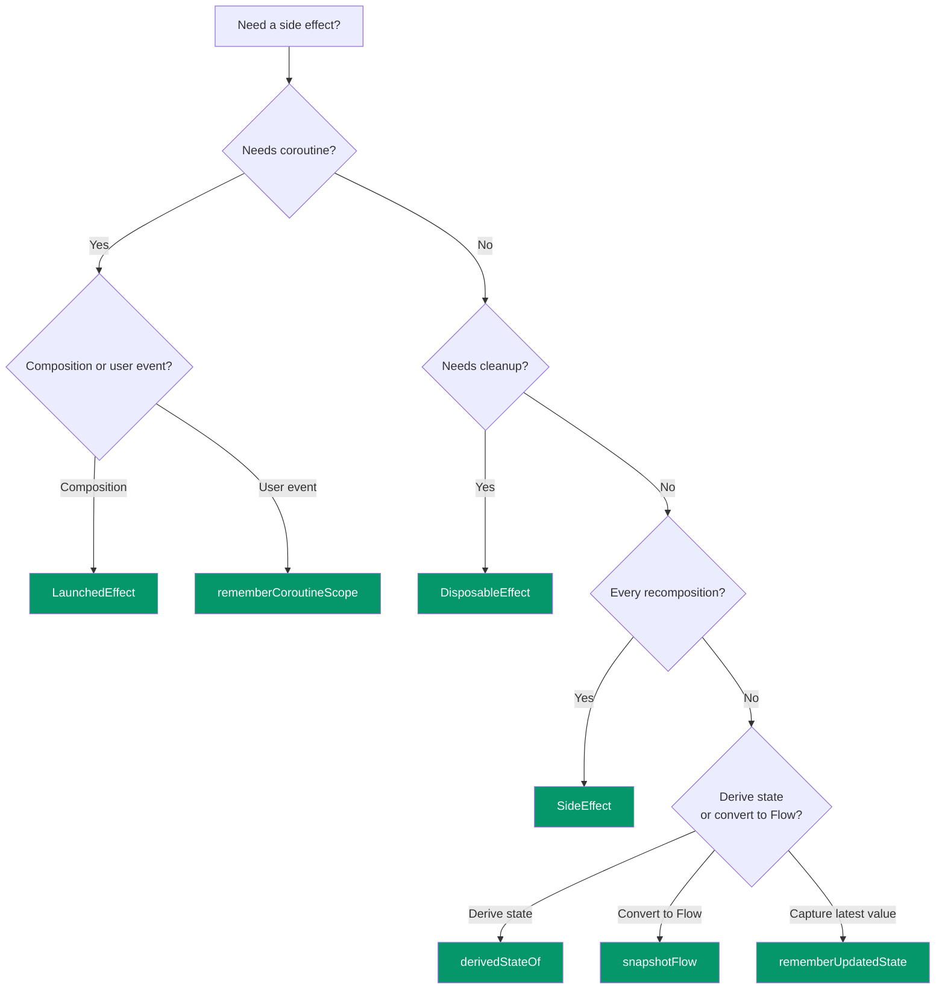

## Android Compose Side Effects Cheatsheet

## Concept Summary

- Side effects are operations **observable outside** a composable function (network calls, listeners, analytics)
- Composables can recompose at any time — side effects in the body run **unpredictably**
- Compose provides **8 Effect APIs** to run side effects in a controlled, lifecycle-aware way
- Each API has different guarantees about **when it runs**, **whether it restarts**, and **how it cleans up**
- Core rule: tie side effects to the **composition lifecycle**, not to function execution

---

## Diagram

---

## Key APIs

| API | Coroutine? | Runs when | Cleanup | Restarts on key? |
|---|---|---|---|---|
| `LaunchedEffect(key)` | ✅ | Enters composition | Coroutine cancelled | ✅ |
| `rememberCoroutineScope` | ✅ | Manual from callback | Cancelled on leave | N/A |
| `rememberUpdatedState` | ❌ | Every recomposition | ❌ | N/A |
| `DisposableEffect(key)` | ❌ | Enters composition | `onDispose` block | ✅ |
| `SideEffect` | ❌ | Every recomposition | ❌ | N/A |
| `produceState(init, key)` | ✅ | Enters composition | Coroutine cancelled | ✅ |
| `derivedStateOf` | ❌ | Source state changes | ❌ | N/A |
| `snapshotFlow` | ❌ (produces Flow) | Collected in coroutine | ❌ | N/A |

---

## Interview Questions

**Q1: Why can't you run side effects directly in a composable body?**
> Composables can recompose at any time, be skipped, or run in parallel. Direct side effects execute unpredictably — use Effect APIs for lifecycle-aware guarantees.

**Q2: LaunchedEffect vs rememberCoroutineScope?**
> `LaunchedEffect` auto-launches on composition and restarts on key change. `rememberCoroutineScope` provides a scope for manual launch from event handlers (clicks, gestures).

**Q3: What does rememberUpdatedState solve?**
> The stale closure problem. It holds the latest value of a changing parameter inside a long-lived effect without restarting the effect.

**Q4: When should you use derivedStateOf?**
> When source state changes more frequently than the derived result (e.g., scroll position changes every pixel but you only care if index > 0). Don't use it to combine states that change at the same rate.

**Q5: What is snapshotFlow?**
> Converts Compose `State` into a cold Flow with built-in `distinctUntilChanged`. Use it when you need Flow operators (debounce, filter, map) on Compose state.

---

## Common Pitfalls

⚠️ **Suspend calls directly in composable body** — use `LaunchedEffect` instead.

⚠️ **Passing `Unit` as key when effect depends on a parameter** — the effect never restarts; pass the actual dependency as the key.

⚠️ **Using `SideEffect` for one-time operations** — it runs on every recomposition; use `LaunchedEffect(Unit)` for one-shot work.

⚠️ **Empty `onDispose {}` when cleanup is actually needed** — causes resource leaks (listeners, observers).

⚠️ **Overusing `derivedStateOf`** — don't use it to combine states that change at the same rate (e.g., `"$firstName $lastName"`). It only helps when the source changes more often than the derived result.

⚠️ **Collecting `snapshotFlow` outside a coroutine** — it produces a cold Flow that must be collected inside a `LaunchedEffect` or similar coroutine scope.

---

## Quick Reference Table

| Scenario | API | Key |
|---|---|---|
| Fetch data on screen open | `LaunchedEffect(id)` | Data identifier |
| One-time initialization | `LaunchedEffect(Unit)` | `Unit` |
| Button click coroutine | `rememberCoroutineScope` | N/A |
| Register lifecycle observer | `DisposableEffect(owner)` | Lifecycle owner |
| Sync state to analytics | `SideEffect` | N/A |
| Convert Flow to State | `collectAsStateWithLifecycle()` | N/A |
| Avoid stale callback | `rememberUpdatedState` | N/A |
| Convert suspend to State | `produceState(init, key)` | Data identifier |
| Show button after scroll threshold | `derivedStateOf { index > 0 }` | N/A |
| Debounce search from Compose state | `snapshotFlow { query }` | N/A |
| Analytics on scroll event | `snapshotFlow` + `filter` | N/A |
