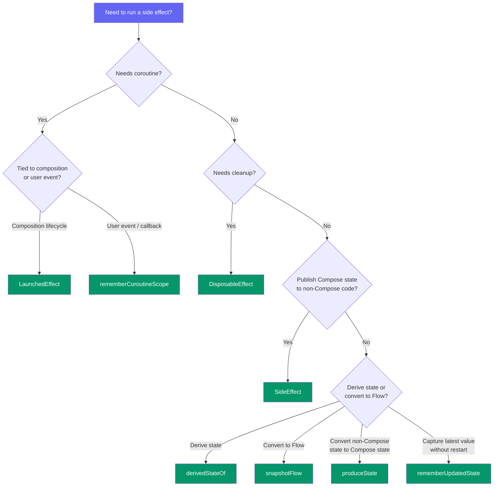
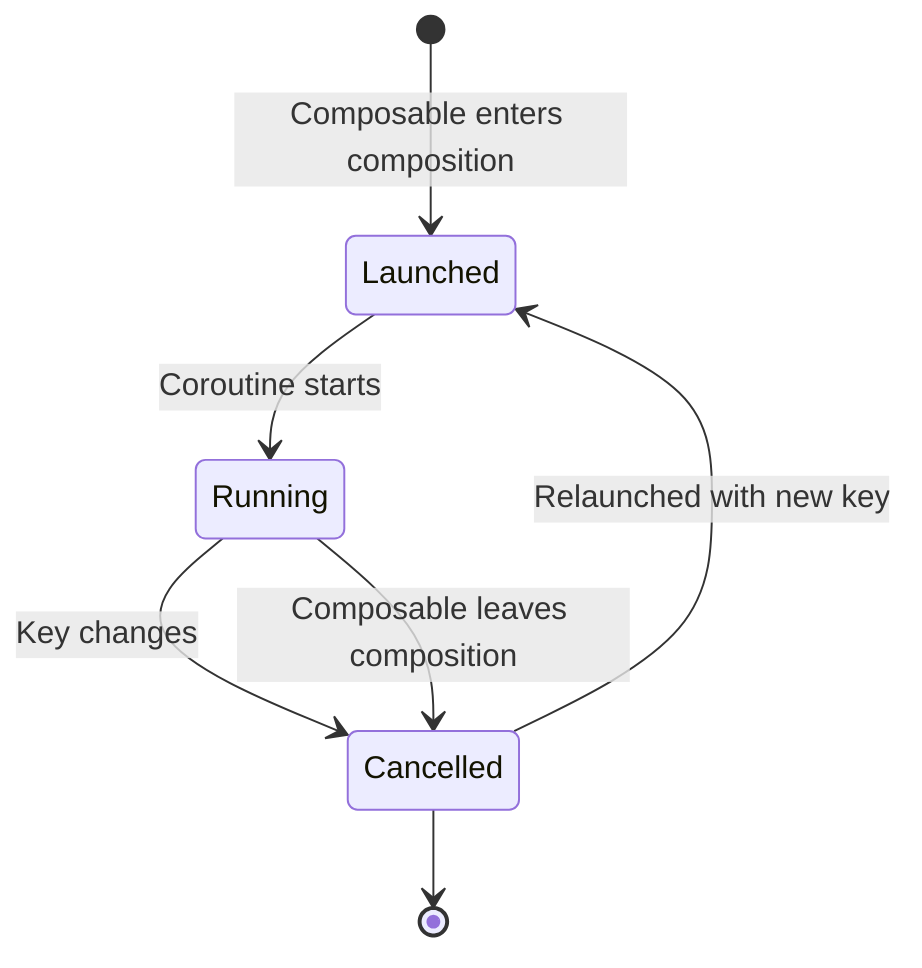

## Introduction

In Jetpack Compose, composable functions should ideally be **pure** — given the same inputs, they produce the same UI with no observable side effects. But real apps need to interact with the outside world: launch network requests, register listeners, write to analytics, start animations. These operations are **side effects**.

Compose provides a set of **Effect APIs** that let you run side effects in a controlled, lifecycle-aware way. Misusing them is one of the most common sources of bugs in Compose code and a frequent topic in Android interviews.

---

## Concept Overview

A **side effect** is any change that is observable outside the scope of a composable function — for example, writing to a shared variable, triggering a network call, or navigating to another screen.

Compose may **recompose** your composable at any time, skip it, or run it in parallel. This means side effects placed directly in a composable body can execute unpredictably. The Effect APIs solve this by giving you **guarantees** about when and how often your side effect runs.

The core principle: **side effects must be tied to the composition lifecycle**, not to the execution of a composable function.

---

## Flow / Architecture Diagram

### Effect APIs Decision Tree



### LaunchedEffect Lifecycle



---

## Key Concepts

### LaunchedEffect

Launches a coroutine scoped to the composition. The coroutine starts when the composable enters the composition and is **cancelled** when it leaves. If the **key** changes, the current coroutine is cancelled and a new one is launched.

```kotlin
@Composable
fun UserProfile(userId: String) {
    var user by remember { mutableStateOf<User?>(null) }

    // Relaunches when userId changes
    LaunchedEffect(userId) {
        user = repository.fetchUser(userId)
    }

    user?.let { Text(it.name) }
}
```

Use when: you need a coroutine tied to the composable's lifecycle (data fetching, animations, snackbar display).

### rememberCoroutineScope

Returns a `CoroutineScope` tied to the composition. Unlike `LaunchedEffect`, the coroutine is launched **manually** from callbacks — not automatically on composition.

```kotlin
@Composable
fun SubmitButton(onSubmit: suspend () -> Unit) {
    val scope = rememberCoroutineScope()

    Button(onClick = {
        // Launched from a user event, not from composition
        scope.launch { onSubmit() }
    }) {
        Text("Submit")
    }
}
```

Use when: you need to launch a coroutine from an event handler (click, gesture, callback).

### rememberUpdatedState

Captures the **latest value** of a parameter inside a long-lived effect without restarting the effect. Solves the stale closure problem.

```kotlin
@Composable
fun TimerScreen(onTimeout: () -> Unit) {
    // Always holds the latest onTimeout without restarting LaunchedEffect
    val currentOnTimeout by rememberUpdatedState(onTimeout)

    LaunchedEffect(Unit) {
        delay(5_000)
        currentOnTimeout()
    }
}
```

Use when: you want to reference the latest value of a changing parameter inside a `LaunchedEffect` that should not restart.

### DisposableEffect

Runs a side effect that requires **cleanup**. The `onDispose` block is called when the composable leaves the composition or when the key changes (before the effect re-runs).

```kotlin
@Composable
fun LifecycleLogger(lifecycleOwner: LifecycleOwner = LocalLifecycleOwner.current) {
    DisposableEffect(lifecycleOwner) {
        val observer = LifecycleEventObserver { _, event ->
            Log.d("Lifecycle", event.toString())
        }
        lifecycleOwner.lifecycle.addObserver(observer)

        onDispose {
            lifecycleOwner.lifecycle.removeObserver(observer)
        }
    }
}
```

Use when: you need to register/unregister listeners, callbacks, or observers.

### SideEffect

Runs on **every successful recomposition**. Used to publish Compose state to non-Compose code (e.g., analytics, logging libraries).

```kotlin
@Composable
fun AnalyticsScreen(screenName: String) {
    SideEffect {
        // Runs on every successful recomposition
        analytics.setCurrentScreen(screenName)
    }
}
```

Use when: you need to synchronize Compose state with external imperative code on every recomposition.

### produceState

Converts **non-Compose state** (Flow, LiveData, callback-based APIs) into Compose `State`. Internally uses `LaunchedEffect`.

```kotlin
@Composable
fun loadNetworkImage(
    url: String,
    imageRepository: ImageRepository = ImageRepository()
): State<Result<Image>> {
    return produceState<Result<Image>>(initialValue = Result.Loading, url, imageRepository) {
        val image = imageRepository.load(url)
        value = if (image == null) {
            Result.Error
        } else {
            Result.Success(image)
        }
    }
}
```

Use when: you need to convert a suspend or callback-based data source into a Compose state.

### derivedStateOf

Converts one or multiple state objects into **another state** that only updates when the derived result actually changes. Acts like `Flow.distinctUntilChanged()` — prevents unnecessary recompositions when the source state changes frequently but the derived value doesn't.

```kotlin
@Composable
fun MessageList(messages: List<Message>) {
    Box {
        val listState = rememberLazyListState()

        LazyColumn(state = listState) {
            // ...
        }

        // firstVisibleItemIndex changes on every scroll (0, 1, 2, 3...)
        // but we only care about whether it's > 0
        val showButton by remember {
            derivedStateOf {
                listState.firstVisibleItemIndex > 0
            }
        }

        AnimatedVisibility(visible = showButton) {
            ScrollToTopButton()
        }
    }
}
```

Use when: a source state changes frequently but you only need to react to a **derived condition** (e.g., threshold crossed, filtered result). Do NOT use it simply to combine two states that update at the same rate — that adds overhead with no benefit.

```kotlin
// ❌ Incorrect — fullName updates at the same rate as firstName/lastName
val fullNameBad by remember { derivedStateOf { "$firstName $lastName" } }

// ✅ Correct — no derivedStateOf needed here
val fullNameCorrect = "$firstName $lastName"
```

### snapshotFlow

Converts Compose `State<T>` into a cold **Flow**. The flow emits a new value whenever the state read inside the `snapshotFlow` block changes (with built-in `distinctUntilChanged` behavior). This lets you use Flow operators like `debounce`, `filter`, `map`, and `distinctUntilChanged` on Compose state.

```kotlin
val listState = rememberLazyListState()

LazyColumn(state = listState) {
    // ...
}

LaunchedEffect(listState) {
    snapshotFlow { listState.firstVisibleItemIndex }
        .map { index -> index > 0 }
        .distinctUntilChanged()
        .filter { it }
        .collect {
            analyticsService.sendScrolledPastFirstItemEvent()
        }
}
```

Use when: you need to react to Compose state changes using Flow operators — debouncing search input, filtering scroll events, or combining multiple state signals.

---

## When to Use in Real Apps

| Scenario | Recommended API |
|---|---|
| Fetch data when screen opens | `LaunchedEffect(key)` |
| Show a snackbar from a one-shot event | `LaunchedEffect` + `snackbarHostState.showSnackbar()` |
| Launch coroutine from button click | `rememberCoroutineScope` |
| Register/unregister a lifecycle observer | `DisposableEffect` |
| Register/unregister a BroadcastReceiver | `DisposableEffect` |
| Sync Compose state to analytics SDK | `SideEffect` |
| Convert a Flow to Compose State | `collectAsStateWithLifecycle()` or `produceState` |
| Avoid restarting effect when callback changes | `rememberUpdatedState` |
| One-time initialization (e.g., scroll to item) | `LaunchedEffect(Unit)` |
| Show "scroll to top" button after threshold | `derivedStateOf` |
| Debounce search input from Compose state | `snapshotFlow` + `debounce` |
| Send analytics on scroll past first item | `snapshotFlow` + `filter` |

---

## Comparison Table

| API | Coroutine? | Runs when | Has cleanup? | Restarts on key change? |
|---|---|---|---|---|
| `LaunchedEffect` | ✅ | Enters composition | Cancelled on leave | ✅ |
| `rememberCoroutineScope` | ✅ | Manually from callback | Cancelled on leave | N/A (no key) |
| `rememberUpdatedState` | ❌ | Every recomposition | ❌ | N/A |
| `DisposableEffect` | ❌ | Enters composition | ✅ `onDispose` | ✅ |
| `SideEffect` | ❌ | Every recomposition | ❌ | N/A (no key) |
| `produceState` | ✅ | Enters composition | Cancelled on leave | ✅ |
| `derivedStateOf` | ❌ | Source state changes | ❌ | N/A |
| `snapshotFlow` | ❌ (produces Flow) | Collected in coroutine | ❌ | N/A |

---

## Common Interview Questions

**Q1: What is a side effect in Compose and why can't you just run one in a composable body?**

> A side effect is any operation observable outside the composable function (network call, logging, navigation). Composable functions can be re-executed at any time, skipped, or run in parallel by the Compose runtime. Placing side effects directly in the body leads to unpredictable execution — they might run multiple times, never run, or run on the wrong thread.

**Q2: What is the difference between LaunchedEffect and rememberCoroutineScope?**

> `LaunchedEffect` launches a coroutine automatically when the composable enters the composition and restarts when its key changes. `rememberCoroutineScope` provides a scope for launching coroutines manually from event handlers (clicks, gestures). Use `LaunchedEffect` for composition-driven effects and `rememberCoroutineScope` for user-driven events.

**Q3: When would you use DisposableEffect over LaunchedEffect?**

> Use `DisposableEffect` when the side effect requires explicit cleanup (removing a listener, unregistering a callback). `LaunchedEffect` handles cleanup via coroutine cancellation, which works for suspend functions but not for imperative register/unregister patterns.

**Q4: What problem does rememberUpdatedState solve?**

> It solves the **stale closure** problem. When a `LaunchedEffect` captures a lambda or value at launch time, that reference becomes stale if the parameter changes during a long-running effect. `rememberUpdatedState` always holds the latest value without restarting the effect.

**Q5: What happens if you pass `Unit` as the key to LaunchedEffect?**

> The effect runs exactly once when the composable enters the composition and never restarts, because `Unit` never changes. This is the pattern for one-time initialization (e.g., scrolling to a specific list position on first load).

**Q6: When should you use derivedStateOf vs just computing the value directly?**

> Use `derivedStateOf` when the source state changes more frequently than the derived result. For example, scroll position changes on every pixel but you only care whether the user scrolled past the first item. If the derived value changes at the same rate as the source (e.g., combining `firstName` + `lastName`), `derivedStateOf` adds unnecessary overhead — just compute the value directly.

**Q7: What is snapshotFlow and when would you use it?**

> `snapshotFlow` converts Compose `State` into a cold Flow with built-in `distinctUntilChanged`. Use it when you need Flow operators (debounce, filter, map) on Compose state — for example, debouncing a search query from a `TextField` state or sending analytics when the user scrolls past a threshold.

---

## Common Mistakes / Pitfalls

⚠️ **Running suspend functions directly in a composable body**
```kotlin
// ❌ This runs on every recomposition — unpredictable and dangerous
@Composable
fun BadExample() {
    val data = repository.fetchData() // suspend call in body
}

// ✅ Use LaunchedEffect
@Composable
fun GoodExample() {
    var data by remember { mutableStateOf<Data?>(null) }
    LaunchedEffect(Unit) {
        data = repository.fetchData()
    }
}
```

⚠️ **Using rememberCoroutineScope inside LaunchedEffect**
- `LaunchedEffect` already provides a coroutine scope. Using `rememberCoroutineScope` inside it creates a confusing double-scope situation.

⚠️ **Forgetting the key parameter in LaunchedEffect**
- Passing a constant key (`Unit`) means the effect never restarts. If the effect depends on a parameter (e.g., `userId`), that parameter must be the key.

⚠️ **Missing onDispose in DisposableEffect**
- `DisposableEffect` requires an `onDispose` block. Forgetting it causes a compile error, but providing an empty `onDispose {}` when cleanup is actually needed causes resource leaks.

⚠️ **Using SideEffect for one-time operations**
- `SideEffect` runs on every recomposition. For one-time operations, use `LaunchedEffect(Unit)` instead.

⚠️ **Overusing derivedStateOf**
- Don't use it to combine states that change at the same rate. It only helps when the source changes more often than the derived result.

⚠️ **Collecting snapshotFlow outside a coroutine scope**
- `snapshotFlow` produces a cold Flow that must be collected inside a coroutine — typically inside a `LaunchedEffect`.

---

## Best Practices

✅ **Choose the right Effect API** — use the decision tree above to pick the correct one for your use case.

✅ **Use meaningful keys in LaunchedEffect and DisposableEffect** — the key should represent the data the effect depends on. When the key changes, the effect restarts.

✅ **Prefer `collectAsStateWithLifecycle()`** over `produceState` for collecting Flows — it handles lifecycle awareness automatically and is the recommended approach.

✅ **Use `rememberUpdatedState`** when a long-lived effect references a callback that may change — avoids stale closures without restarting the effect.

✅ **Keep side effects minimal** — do the minimum work necessary inside an effect. Delegate heavy logic to a ViewModel or repository.

✅ **Use `snapshotFlow { }`** to convert Compose State into a Flow when you need to react to state changes with Flow operators (debounce, distinctUntilChanged, etc.).

✅ **Use `derivedStateOf`** only when the source state changes more frequently than the derived value — it reduces unnecessary recompositions in those cases.

---

## Quick Cheatsheet

| Scenario | API | Key |
|---|---|---|
| Fetch data on screen open | `LaunchedEffect(id)` | Data identifier |
| One-time scroll to position | `LaunchedEffect(Unit)` | `Unit` (never restarts) |
| Button click launches coroutine | `rememberCoroutineScope` | N/A |
| Register lifecycle observer | `DisposableEffect(owner)` | Lifecycle owner |
| Sync state to analytics | `SideEffect` | N/A (every recomposition) |
| Convert Flow to State | `collectAsStateWithLifecycle()` | N/A |
| Avoid stale callback in effect | `rememberUpdatedState` | N/A |
| Convert suspend to State | `produceState(initial, key)` | Data identifier |
| Show button after scroll threshold | `derivedStateOf { index > 0 }` | N/A |
| Debounce search from Compose state | `snapshotFlow { query }` | N/A |
| React to Compose state with Flow ops | `snapshotFlow { state }` | N/A |

---

## Summary

Key takeaways:

- Composable functions can recompose at any time, so side effects must be managed through dedicated **Effect APIs**.
- **LaunchedEffect** launches a coroutine tied to the composition lifecycle; it restarts when its key changes.
- **rememberCoroutineScope** provides a scope for launching coroutines from event handlers (clicks, gestures).
- **rememberUpdatedState** captures the latest value inside a long-lived effect without restarting it.
- **DisposableEffect** handles side effects that require explicit cleanup via `onDispose`.
- **SideEffect** runs on every successful recomposition — use it to sync Compose state to external code.
- **produceState** converts non-Compose data sources into Compose `State`.
- **derivedStateOf** creates derived state that only triggers recomposition when the derived result actually changes — ideal for high-frequency source states.
- **snapshotFlow** converts Compose State into a Flow, enabling Flow operators like debounce and filter on Compose state.
- Always choose the **right Effect API** for the job — the decision tree maps each use case to the correct API.

---

## Reference

- [Side-effects in Compose — Android Developers](https://developer.android.com/develop/ui/compose/side-effects)
- [State and Jetpack Compose — Android Developers](https://developer.android.com/develop/ui/compose/state)
- [Thinking in Compose — Android Developers](https://developer.android.com/develop/ui/compose/mental-model)
- [Lifecycle of composables — Android Developers](https://developer.android.com/develop/ui/compose/lifecycle)
