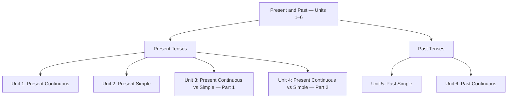

## Introduction

This post covers the **Present and Past** topic from *English Grammar in Use* by Raymond Murphy, spanning **Units 1–6**. These six units build the foundation of English tenses — from what is happening right now, to habits and facts, all the way to finished past events and what was ongoing at a moment in the past.

Understanding these tenses is essential because they appear in almost every conversation and piece of writing in English. The units follow a natural progression: we start with the two present tenses (Units 1–2), compare them in detail (Units 3–4), and then move into the past (Units 5–6).

---

## Topic Overview

---

## Unit 1: Present Continuous (I am doing)

### Grammar Rule

Use the **Present Continuous** to talk about:

- something **happening right now**, at the moment of speaking
- something **happening around this time** (but not necessarily at this exact second)
- a **temporary situation** that is in progress

It is formed with **be (am/is/are) + verb-ing**.

### Form Table

| Subject         | Positive          | Negative               | Question              |
| --------------- | ----------------- | ---------------------- | --------------------- |
| I               | am working        | am not working         | Am I working?         |
| He / She / It   | is working        | is not (isn't) working | Is she working?       |
| You / We / They | are working       | are not (aren't) working | Are they working?   |

### Key Examples

**Positive:**
- I **am reading** a book right now.
- She **is cooking** dinner at the moment.
- They **are building** a new house this month.

**Negative:**
- He **isn't watching** TV now.
- We **aren't working** today — it's a holiday.

**Question:**
- **Are** you **listening** to me?
- **Is** it **raining** outside?
- What **are** you **doing** tonight?

### When to Use

| Situation                          | Example                                      |
| ---------------------------------- | -------------------------------------------- |
| Action happening right now         | *Be quiet — the baby is sleeping.*           |
| Temporary situation                | *She is staying at a hotel this week.*       |
| Planned future arrangement         | *We are meeting them tomorrow.*              |
| Changing or developing situation   | *The weather is getting colder.*             |

### Common Mistakes

❌ *I am knowing the answer.*  
✅ *I know the answer.*  
*(State verbs like know, like, believe, want are NOT used in continuous form.)*

❌ *She is have a car.*  
✅ *She has a car.*

❌ *He is work right now.*  
✅ *He is working right now.*

---

## Unit 2: Present Simple (I do)

### Grammar Rule

Use the **Present Simple** to talk about:

- **habits and routines** — things you do regularly
- **facts and permanent truths** — things that are always true
- **schedules and timetables** — fixed plans

It is formed with the **base verb** (add **-s** or **-es** for he/she/it).

### Form Table

| Subject             | Positive  | Negative            | Question          |
| ------------------- | --------- | ------------------- | ----------------- |
| I / You / We / They | work      | don't work          | Do you work?      |
| He / She / It       | works     | doesn't work        | Does she work?    |

### Key Examples

**Positive:**
- I **get up** at 7 every morning.
- The sun **rises** in the east.
- She **works** in a hospital.

**Negative:**
- He **doesn't drink** coffee.
- They **don't live** in the city.

**Question:**
- **Do** you **like** spicy food?
- **Does** he **know** your name?
- What time **does** the train **leave**?

### When to Use

| Situation                    | Example                                       |
| ---------------------------- | --------------------------------------------- |
| Habits and routines          | *I go to the gym three times a week.*         |
| Permanent facts              | *Water boils at 100°C.*                       |
| Timetables / schedules       | *The bus leaves at 8:30.*                     |
| State verbs (feelings, etc.) | *I love this music.*                          |

### Common Mistakes

❌ *She don't like spicy food.*  
✅ *She doesn't like spicy food.*

❌ *He work in a bank.*  
✅ *He works in a bank.*

❌ *Do he play football?*  
✅ *Does he play football?*

---

## Unit 3: Present Continuous and Present Simple — Part 1

### Grammar Rule

This unit focuses on the **core difference** between the two present tenses:

- **Present Continuous** → something happening **now or around now** (temporary)
- **Present Simple** → something that is **always true or happens regularly** (permanent / habitual)

The key question to ask yourself: *Is this happening right now / temporarily? Or is it a general truth / habit?*

### Key Examples

| Present Continuous (now/temporary)     | Present Simple (habit/fact)          |
| -------------------------------------- | ------------------------------------ |
| *Be quiet! The baby **is sleeping**.*  | *The baby usually **sleeps** at 9.*  |
| *I **am reading** a great book.*       | *I **read** every night.*            |
| *She **is living** in London now.*     | *She **lives** in London.*           |
| *It **is raining** today.*             | *It **rains** a lot in England.*     |

### When to Use

Use **Present Continuous** when you see signal words like: *now, at the moment, right now, currently, today, this week, this year.*

Use **Present Simple** when you see signal words like: *always, usually, often, sometimes, rarely, never, every day/week/month.*

### Common Mistakes

❌ *I am going to school every day.*  
✅ *I go to school every day.*

❌ *She works in the garden right now.*  
✅ *She is working in the garden right now.*

---

## Unit 4: Present Continuous and Present Simple — Part 2

### Grammar Rule

Unit 4 introduces **state verbs** — verbs that describe states (not actions) and are almost **never used in the continuous form**.

Common state verbs:

| Category   | Verbs                                              |
| ---------- | -------------------------------------------------- |
| Thinking   | know, believe, understand, think (opinion), realise|
| Feelings   | like, love, hate, want, need, prefer, wish         |
| Senses     | see, hear, smell, taste, feel (involuntary)        |
| Being      | be, seem, appear, consist, contain, belong         |

Some verbs can be **both state and action** depending on meaning:

| Verb  | State (Simple)                    | Action (Continuous)                  |
| ----- | --------------------------------- | ------------------------------------ |
| think | *I **think** he is right.* (opinion) | *I **am thinking** about you.* (mental process) |
| have  | *She **has** a car.* (possession)    | *She **is having** dinner.* (activity) |
| see   | *I **see** him.* (perceive)           | *I **am seeing** the doctor.* (appointment) |
| smell | *This **smells** nice.* (state)       | *He **is smelling** the flowers.* (action) |

### Key Examples

❌ *I am knowing the answer.*  
✅ *I know the answer.*

❌ *She is wanting a coffee.*  
✅ *She wants a coffee.*

✅ *I am thinking about my future.* (mental activity — OK)  
✅ *I think it's a good idea.* (opinion — simple)

✅ *We are having a great time.* (activity — OK)  
✅ *He has two sisters.* (possession — simple)

### Common Mistakes

❌ *I am loving this song!*  
✅ *I love this song!*

❌ *She is believing in ghosts.*  
✅ *She believes in ghosts.*

---

## Unit 5: Past Simple (I did)

### Grammar Rule

Use the **Past Simple** to talk about a completed action at a **specific time in the past**. The time is finished and the action is over.

It is formed with the **past form of the verb** (regular: add **-ed**; irregular: learn the form).

### Form Table

| Subject  | Positive (regular)  | Positive (irregular) | Negative           | Question           |
| -------- | ------------------- | -------------------- | ------------------ | ------------------ |
| All      | worked / walked     | went / saw / had     | didn't work / go   | Did you work / go? |

### Key Examples

**Positive:**
- I **worked** late last night.
- She **went** to Paris last summer.
- We **had** a great time at the party.

**Negative:**
- He **didn't come** to the meeting.
- They **didn't know** the answer.

**Question:**
- **Did** you **see** that film?
- When **did** she **arrive**?
- **Did** it **rain** yesterday?

### When to Use

| Situation                              | Example                                   |
| -------------------------------------- | ----------------------------------------- |
| Completed action at a specific time    | *I visited Rome in 2022.*                 |
| Series of past events                  | *She opened the door, walked in, and sat down.* |
| Past habit or repeated action          | *He played football every Saturday.*      |

Signal words: *yesterday, last week/month/year, ago, in 2020, when I was young.*

### Common Mistakes

❌ *I did go to the shop yesterday.*  
✅ *I went to the shop yesterday.* *(Don't use "did" in positive sentences.)*

❌ *She didn't went home.*  
✅ *She didn't go home.* *(Use base verb after did/didn't.)*

❌ *Did he went to school?*  
✅ *Did he go to school?*

---

## Unit 6: Past Continuous (I was doing)

### Grammar Rule

Use the **Past Continuous** to describe:

- an action that was **in progress at a specific moment in the past**
- an action that was **ongoing when another (shorter) action happened**
- two actions that were **happening at the same time in the past**

It is formed with **was/were + verb-ing**.

### Form Table

| Subject         | Positive          | Negative                 | Question              |
| --------------- | ----------------- | ------------------------ | --------------------- |
| I / He / She / It   | was working   | was not (wasn't) working | Was she working?      |
| You / We / They | were working      | were not (weren't) working | Were they working?  |

### Key Examples

**Action in progress at a past moment:**
- At 8 o'clock last night, I **was watching** TV.
- What **were** you **doing** at this time yesterday?

**Ongoing action interrupted by a shorter one (with Past Simple):**
- I **was walking** home when it **started** to rain.
- She **was reading** when her phone **rang**.
- They **were eating** dinner when we **arrived**.

**Two actions happening at the same time:**
- While she **was cooking**, he **was setting** the table.
- I **was studying** while my sister **was playing** games.

### When to Use

| Situation                             | Example                                          |
| ------------------------------------- | ------------------------------------------------ |
| In progress at a past moment          | *At midnight, she was still working.*            |
| Interrupted by another action         | *He was sleeping when the alarm went off.*       |
| Parallel past actions                 | *While I was cooking, she was reading.*          |
| Background description in a story     | *The sun was shining and the birds were singing.*|

Signal words: *while, when, at that time, at 8 o'clock last night, all morning.*

### Common Mistakes

❌ *When I arrived, she was cooked dinner.*  
✅ *When I arrived, she was cooking dinner.*

❌ *I was see him yesterday.*  
✅ *I saw him yesterday.* *(State verbs don't use continuous form.)*

❌ *They were knowing the truth.*  
✅ *They knew the truth.*

---

## Topic Comparison Table

| Tense               | Use                                              | Signal Words                             |
| ------------------- | ------------------------------------------------ | ---------------------------------------- |
| Present Continuous  | Action happening now / temporary / arrangement   | now, at the moment, right now, this week |
| Present Simple      | Habits, routines, facts, state verbs             | always, usually, every day, never        |
| Past Simple         | Completed action at a specific past time         | yesterday, last week, ago, in 2020       |
| Past Continuous     | Action in progress at a past time / interrupted  | while, when, at that time, all morning   |

### Present vs Past at a Glance

| Tense               | Now / Habit?          | Past?   | In Progress? |
| ------------------- | --------------------- | ------- | ------------ |
| Present Continuous  | Now / temporary       | ✗       | ✅            |
| Present Simple      | Habit / fact          | ✗       | ✗            |
| Past Simple         | ✗                     | ✅ (done)| ✗            |
| Past Continuous     | ✗                     | ✅       | ✅            |

---

## 📝 Quick Summary

**Unit 1 — Present Continuous (I am doing):**
- Use *am/is/are + verb-ing* for actions happening now or around now.
- Don't forget: state verbs (*know, like, want*) cannot be used in continuous form.

**Unit 2 — Present Simple (I do):**
- Use the base verb for habits, routines, and permanent facts.
- Don't forget: add **-s/-es** for he/she/it, and use *doesn't/don't* for negatives.

**Unit 3 — Present Continuous vs Simple (Part 1):**
- Continuous = happening now / temporary. Simple = habit / permanent.
- Don't forget: signal words help — *right now* → continuous, *every day* → simple.

**Unit 4 — Present Continuous vs Simple (Part 2):**
- Some verbs are state verbs and are NEVER used in continuous form (*know, love, want, believe*).
- Don't forget: some verbs (*think, have, see*) change meaning depending on continuous or simple form.

**Unit 5 — Past Simple (I did):**
- Use the past form of the verb for completed actions at a specific time in the past.
- Don't forget: use base verb after *didn't* and *did* in questions and negatives.

**Unit 6 — Past Continuous (I was doing):**
- Use *was/were + verb-ing* for an action in progress at a past moment or interrupted by another past action.
- Don't forget: use Past Continuous for the background action and Past Simple for the interrupting action: *I was cooking when she arrived.*
