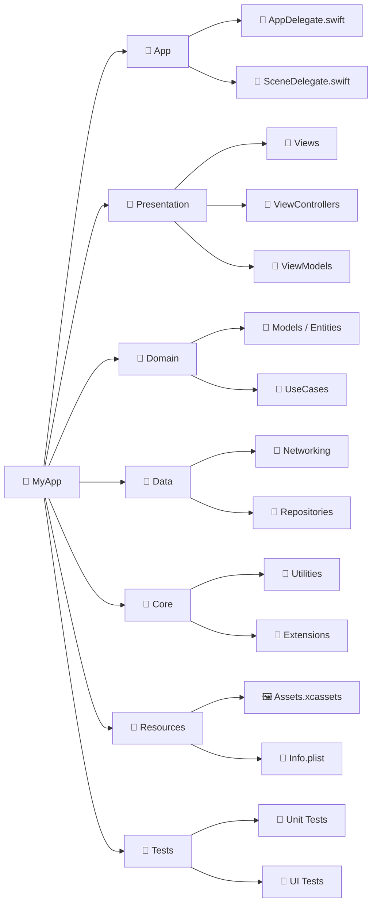

> **Overview:** A summary of the standard iOS project file structure, key application files, and common architectural patterns used in modern iOS development.

---

## 🧭 High-Level Project Structure

A well-organized iOS project separates concerns into clear, distinct directories. While small apps might start with a flat structure, a modern, scalable iOS app (often using MVVM or Clean Architecture) typically follows a structure like this:

---

## 📄 Key Files Explained

Every iOS project comes with a set of default files critical carefully managing the app's configuration and lifecycle.

| File / Component | Purpose |
|---|---|
| `AppDelegate.swift` | Handles **app-level** lifecycle events (e.g., app launch, push notifications registration, background fetch). |
| `SceneDelegate.swift` | Introduced in iOS 13, handles **UI-level** lifecycle events (foreground, background) and supports multi-window setups. |
| `MyApp.swift` (SwiftUI) | The `@main` entry point for pure SwiftUI apps, replacing the need for AppDelegate/SceneDelegate in many cases. |
| `Info.plist` | Property List file containing configuration data (bundle ID, version), and **user permissions** (e.g., Camera, Location access). |
| `Assets.xcassets` | Centralized repository for organizing images, color sets, and app icons. |
| `LaunchScreen.storyboard` | The initial screen displayed immediately by the OS while the app is loading into memory. |

---

## 🏗 Common Architecture Patterns

How you structure your code within the folders depends heavily on the chosen architecture:

1. **MVC (Model-View-Controller)**
   - Apple's default pattern.
   - **Pros:** Simple, built into Cocoa Touch.
   - **Cons:** Often leads to "Massive View Controller" because ViewControllers end up handling networking, routing, and data formatting.

2. **MVVM (Model-View-ViewModel)**
   - Highly popular in modern iOS, especially with **SwiftUI**.
   - **Pros:** Extracts presentation logic from the View/ViewController into a ViewModel. Easily testable. Relies on data binding (via `Combine`, `RxSwift`, or SwiftUI's `@State`/`@Published`).

3. **VIPER / Clean Architecture**
   - View, Interactor, Presenter, Entity, Router.
   - **Pros:** Extremely decoupled, clear boundaries, highly testable.
   - **Cons:** High boilerplate; over-engineering for small or simple apps.

---

## 📦 Dependency Management

When building an iOS app, you often rely on external libraries. These are managed via:

- **Swift Package Manager (SPM)**: Apple's native, modern dependency manager. Integrated directly into Xcode. Uses `Package.swift` (or Xcode UI). **(Highly Recommended)**
- **CocoaPods**: The most established 3rd-party manager. Uses a `Podfile` and generates an `.xcworkspace` that you must use instead of the `.xcodeproj`.
- **Carthage**: A decentralized dependency manager that builds your dependencies into binary frameworks and leaves integrating them up to you.

---

## ✅ Best Practices for iOS Project Structure

- **Modularization**: As projects grow, break code down into reusable **Swift Packages** or local frameworks (e.g., separating the `Network` layer from the `UI` layer).
- **Separation of Concerns**: Keep ViewControllers and Views entirely free of business logic and network requests.
- **Resource Code Generation**: Use tools like [SwiftGen](https://github.com/SwiftGen/SwiftGen) to auto-generate type-safe references for your `Assets.xcassets`, Strings, and Storyboards to avoid string-typing crashes.
- **Group by Feature vs Type**: For medium-to-large apps, grouping folders by **Feature** (e.g., `Profile/`, `Login/`, `Home/`) rather than by **Type** (e.g., `ViewModels/`, `Views/`) often makes navigation easier.
