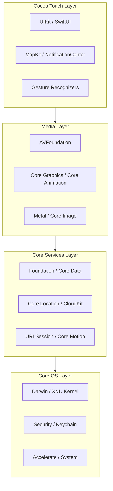
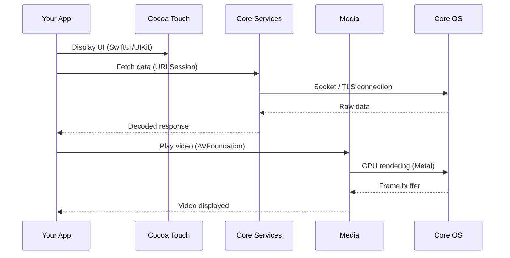

## Introduction

Every iOS app runs on top of a carefully designed layered architecture. Understanding how these layers work together is essential for iOS developers — it helps you choose the right framework for the job, debug issues more effectively, and write more performant code.

Whether you're handling low-level networking, playing audio, or building a SwiftUI interface, you're interacting with one or more of these layers. This post breaks down the four main layers of iOS and explains what each one provides.

## Concept Overview

iOS is built on a layered architecture derived from macOS, which itself is based on a Darwin/XNU kernel. The system is organized into four abstraction layers, each building on the one below:

- **Cocoa Touch** — the topmost layer, providing UI frameworks and high-level app services
- **Media** — handles graphics, audio, and video rendering
- **Core Services** — provides fundamental data management, networking, and system services
- **Core OS** — the lowest layer, managing hardware interaction, security, and the kernel

Apps should always prefer higher-level frameworks when possible. Lower layers offer more control but require more effort and careful resource management.

## Architecture Diagram



## Key Concepts

### 1. Core OS Layer

The foundation of iOS. It sits directly on the hardware and provides low-level services.

| Framework / Component | Purpose |
| --- | --- |
| Darwin / XNU Kernel | Process management, memory, threading |
| Security | Keychain access, certificates, encryption |
| Accelerate | High-performance math and DSP operations |
| System | Low-level POSIX APIs, sockets, file I/O |
| Local Authentication | Touch ID / Face ID biometric authentication |

The kernel is based on XNU (X is Not Unix), a hybrid kernel combining the Mach microkernel and BSD components. It handles process scheduling, virtual memory, and hardware driver communication.

```swift
// Example: Using Local Authentication (biometrics)
import LocalAuthentication

let context = LAContext()
var error: NSError?

if context.canEvaluatePolicy(.deviceOwnerAuthenticationWithBiometrics, error: &error) {
    context.evaluatePolicy(.deviceOwnerAuthenticationWithBiometrics,
                           localizedReason: "Authenticate to access your data") { success, error in
        if success {
            // Authenticated
        }
    }
}
```

### 2. Core Services Layer

Provides essential system services that most apps rely on, including data persistence, networking, and location.

| Framework | Purpose |
| --- | --- |
| Foundation | Strings, collections, dates, file management |
| Core Data | Object graph and persistence framework |
| CloudKit | iCloud data storage and sync |
| Core Location | GPS and location services |
| URLSession | HTTP networking and downloads |
| Core Motion | Accelerometer, gyroscope, pedometer data |

```swift
// Example: Fetching data with URLSession
let url = URL(string: "https://api.example.com/data")!
let task = URLSession.shared.dataTask(with: url) { data, response, error in
    guard let data = data else { return }
    // Process data
}
task.resume()
```

### 3. Media Layer

Handles all graphics rendering, audio/video playback, and image processing.

| Framework | Purpose |
| --- | --- |
| AVFoundation | Audio/video capture and playback |
| Core Graphics (Quartz) | 2D drawing and PDF rendering |
| Core Animation | Hardware-accelerated animations |
| Metal | Low-level GPU access for graphics and compute |
| Core Image | Image filtering and processing |
| SpriteKit / SceneKit | 2D and 3D game frameworks |

```swift
// Example: Playing audio with AVFoundation
import AVFoundation

var player: AVAudioPlayer?

func playSound(named name: String) {
    guard let url = Bundle.main.url(forResource: name, withExtension: "mp3") else { return }
    player = try? AVAudioPlayer(contentsOf: url)
    player?.play()
}
```

### 4. Cocoa Touch Layer

The highest-level layer and the one developers interact with most. It provides the UI framework and high-level app services.

| Framework | Purpose |
| --- | --- |
| UIKit | Views, view controllers, app lifecycle |
| SwiftUI | Declarative UI framework |
| MapKit | Embedded maps and annotations |
| UserNotifications | Local and remote push notifications |
| ARKit | Augmented reality experiences |
| WidgetKit | Home screen and Lock Screen widgets |

```swift
// Example: A simple SwiftUI view
import SwiftUI

struct ContentView: View {
    var body: some View {
        VStack {
            Text("Hello, iOS Architecture!")
                .font(.title)
            Image(systemName: "cpu")
                .imageScale(.large)
        }
    }
}
```

## When to Use in Real Apps

| Scenario | Recommended Layer / Framework |
| --- | --- |
| Build a standard UI screen | Cocoa Touch — UIKit or SwiftUI |
| Play background audio | Media — AVFoundation |
| Store structured data locally | Core Services — Core Data |
| Encrypt sensitive user data | Core OS — Security / Keychain |
| Apply real-time image filters | Media — Core Image |
| Track user location | Core Services — Core Location |
| Perform heavy matrix math | Core OS — Accelerate |
| Render custom 3D graphics | Media — Metal |

## Comparison Table

| Aspect | Core OS | Core Services | Media | Cocoa Touch |
| --- | --- | --- | --- | --- |
| Abstraction level | Lowest | Low–Mid | Mid–High | Highest |
| Primary language | C | Obj-C / Swift | Obj-C / Swift | Swift |
| Typical use | Security, kernel | Data, networking | Graphics, audio | UI, app lifecycle |
| Direct HW access | Yes | No | GPU only | No |
| Developer frequency | Rare | Common | Moderate | Very common |

## Communication Between Layers



## Common Interview Questions

**Q: What are the four layers of iOS architecture?**
Core OS, Core Services, Media, and Cocoa Touch. Each layer builds on the one below, with Core OS closest to hardware and Cocoa Touch providing the UI frameworks.

**Q: Why should developers prefer higher-level frameworks?**
Higher-level frameworks abstract away complexity, are better optimized by Apple, and receive more frequent updates. They reduce boilerplate and potential for bugs. Use lower-level APIs only when you need fine-grained control.

**Q: What kernel does iOS use?**
iOS uses the XNU kernel, a hybrid kernel that combines the Mach microkernel with BSD subsystems. It's the same kernel family used by macOS.

**Q: Where does Metal fit in the architecture?**
Metal sits in the Media layer and provides low-level, direct GPU access for both graphics rendering and general-purpose compute tasks. It's used by higher-level frameworks like Core Animation and SceneKit under the hood.

**Q: How does the iOS sandbox relate to the architecture?**
The sandbox is enforced at the Core OS layer. Each app runs in its own isolated environment with restricted file system access, ensuring apps cannot interfere with each other or the system.

## Common Mistakes / Pitfalls

⚠️ Using low-level C APIs when a high-level Swift framework exists — adds complexity without benefit.

⚠️ Calling Core Location or Core Motion APIs without checking permissions first — leads to silent failures.

⚠️ Performing heavy Core Graphics drawing on the main thread — causes UI freezes and dropped frames.

⚠️ Ignoring the security layer — storing sensitive data in UserDefaults instead of the Keychain.

⚠️ Assuming all frameworks are available on all devices — some frameworks like ARKit require specific hardware capabilities.

## Best Practices

✅ Always use the highest-level API that meets your requirements.

✅ Use the Keychain (Core OS) for sensitive data, not UserDefaults.

✅ Offload heavy media processing and Core Graphics work to background threads.

✅ Check device capabilities before using hardware-dependent frameworks like ARKit or Core Motion.

✅ Leverage Combine or async/await for clean communication between layers.

✅ Profile with Instruments to identify which layer is causing performance bottlenecks.

## Quick Cheatsheet

| What you need | Framework | Layer |
| --- | --- | --- |
| Build UI | UIKit / SwiftUI | Cocoa Touch |
| Network requests | URLSession | Core Services |
| Local database | Core Data / SwiftData | Core Services |
| Play audio/video | AVFoundation | Media |
| Custom drawing | Core Graphics | Media |
| GPU rendering | Metal | Media |
| Biometric auth | LocalAuthentication | Core OS |
| Encrypt data | Security | Core OS |
| Push notifications | UserNotifications | Cocoa Touch |
| Location tracking | Core Location | Core Services |

## Summary

Key takeaways:

- iOS uses a four-layer architecture: Core OS → Core Services → Media → Cocoa Touch
- Each layer builds on the one below, with higher layers providing more abstraction
- The XNU kernel at the Core OS layer manages hardware, memory, and security
- Most app development happens at the Cocoa Touch and Core Services layers
- Always prefer higher-level APIs unless you need fine-grained control

## References

- [Apple Developer Documentation — About the iOS Technologies](https://developer.apple.com/library/archive/documentation/Miscellaneous/Conceptual/iPhoneOSTechOverview/Introduction/Introduction.html)
- [Apple Developer Documentation — Cocoa Touch Layer](https://developer.apple.com/library/archive/documentation/Miscellaneous/Conceptual/iPhoneOSTechOverview/iPhoneOSTechnologies/iPhoneOSTechnologies.html)
- [Apple Developer Documentation — Security Framework](https://developer.apple.com/documentation/security)
- [Apple Developer Documentation — AVFoundation](https://developer.apple.com/av-foundation/)
- [Apple Developer Documentation — Metal](https://developer.apple.com/metal/)
