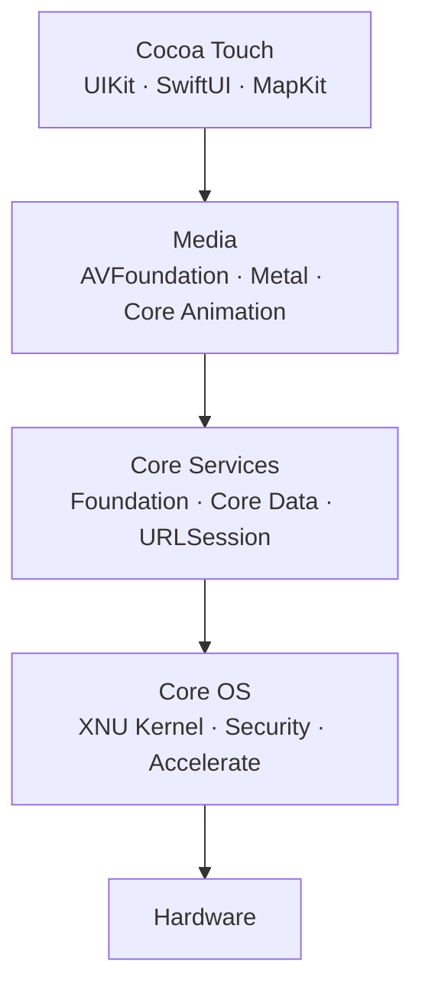

## Concept Summary

• iOS uses a four-layer architecture: Core OS, Core Services, Media, and Cocoa Touch
• Each layer builds on the one below — higher layers provide more abstraction
• The XNU kernel (Mach + BSD) sits at the bottom, managing hardware and security
• Apps should always prefer the highest-level API available
• Apps never communicate with hardware directly — all access goes through the layers

## Diagram

## Key APIs

| Layer | Key Frameworks | Purpose |
| --- | --- | --- |
| Cocoa Touch | UIKit, SwiftUI, WidgetKit | UI, gestures, app lifecycle |
| Media | AVFoundation, Metal, Core Graphics | Audio, video, GPU, drawing |
| Core Services | Foundation, Core Data, URLSession | Data, networking, location |
| Core OS | Security, Accelerate, LocalAuthentication | Kernel, crypto, biometrics |

## Common Interview Questions

What are the four layers of iOS architecture and what does each one do?

What kernel does iOS use, and how does it relate to macOS?

Why should developers prefer higher-level frameworks over lower-level APIs?

## Common Pitfalls

⚠️ Storing passwords in UserDefaults instead of the Keychain (Core OS Security framework)

⚠️ Doing heavy Core Graphics rendering on the main thread — causes UI jank

⚠️ Using low-level C APIs when a Swift framework already wraps the functionality

## Quick Reference Table

| Scenario | Recommended Framework | Layer |
| --- | --- | --- |
| Build a screen | UIKit / SwiftUI | Cocoa Touch |
| Make HTTP requests | URLSession | Core Services |
| Store structured data | Core Data / SwiftData | Core Services |
| Play audio/video | AVFoundation | Media |
| Encrypt sensitive data | Security / Keychain | Core OS |
| Biometric login | LocalAuthentication | Core OS |
| Custom 2D drawing | Core Graphics | Media |
| GPU compute / 3D | Metal | Media |
