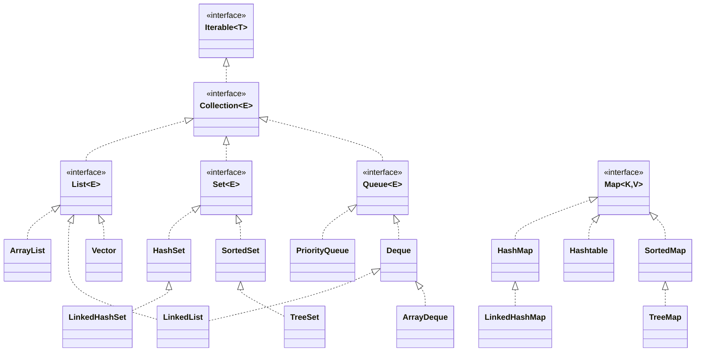

> **Overview:** A comprehensive guide to the Java Collections Framework, mapping out its core interfaces, common object implementations, time complexity, and practical usage tips.

---

## 🧭 What is the Java Collections Framework?

The Java Collections Framework (JCF) provides a set of well-designed interfaces and classes that represent groups of objects as a single unit or "collection". Utilizing the JCF minimizes standard coding effort, improves system performance, and facilitates interoperability between unrelated networking/database APIs.

---

## 🏗 Collections Hierarchy

The core interfaces encapsulate different collection behaviors. Note that `Map` does not formally inherit from `Collection`, but it's an indispensable component of the broader framework.



---

## 📄 Core Interfaces Explored

### 1. `List`
An ordered sequence that allows duplicate elements. You can access elements randomly via an integer index.
*   **`ArrayList`**: A dynamically resizing array. Extremely fast random access and iteration. Slow insertions/deletions in the middle due to element shifting.
*   **`LinkedList`**: A doubly-linked list. Fast insertions/deletions if the node is known. Comparatively slow random access because it must traverse pointers.
*   **`Vector`**: Legacy class. Functionally similar to `ArrayList` but explicitly thread-safe (synchronized), making it slower. Rarely used today.

### 2. `Set`
A mathematical set abstraction that forbids duplicate elements.
*   **`HashSet`**: Backed by a `HashMap`. Offers O(1) time complexity for additions, removals, and lookups. It provides **no guarantees** regarding the order of iteration.
*   **`LinkedHashSet`**: Adds a doubly-linked list through the hash table entries. Iterates predictably in the exact order elements were inserted.
*   **`TreeSet`**: Implements `SortedSet`. Organizes elements under a Red-Black tree structure. Iterates according to natural ordering or a provided `Comparator`. Time complexity is O(log N).

### 3. `Queue` & `Deque`
Structures intended for holding elements right before processing via First-In-First-Out (FIFO) or Last-In-First-Out (LIFO).
*   **`PriorityQueue`**: Backed by a priority heap. Elements are served based on their priority (decided by natural ordering or a `Comparator`), rather than insertion order.
*   **`ArrayDeque`**: A resizable-array implementation of `Deque` (Double Ended Queue). Highly efficient—significantly faster than `Stack` when used as a stack, and often faster than `LinkedList` when used as a standard queue.

### 4. `Map`
An object that charts unique keys to specific values. A single key resolves to exactly one value at most.
*   **`HashMap`**: Provides O(1) basic operations. Elements remain unordered.
*   **`LinkedHashMap`**: Similar behavior to HashMap but maintains insertion order via an internally linked list. Useful for caches (e.g., LRU Cache).
*   **`TreeMap`**: Keeps keys in a sorted tree structure. O(log N) fetch time.
*   **`ConcurrentHashMap`**: The modern, thread-safe equivalent to legacy `Hashtable`. Highly optimized for concurrency using bucket-level locking.

---

## ⏱ Time Complexity Summary

Optimizing specific data structures boils down to these operational benchmarks:

| Data Structure | Get / Access | Add / Insert | Remove / Delete | Primary Use Case |
|---|---|---|---|---|
| **ArrayList** | O(1) | O(N)* | O(N) | Default list choice, CPU cache-friendly |
| **LinkedList** | O(N) | O(1)** | O(1)** | Rare insertions strictly at ends |
| **HashSet** | O(1) | O(1) | O(1) | Stripping duplicates fast |
| **TreeSet** | O(log N) | O(log N) | O(log N) | Maintaining a sorted pool |
| **HashMap** | O(1) | O(1) | O(1) | Default associative key-value pair |
| **TreeMap** | O(log N) | O(log N) | O(log N) | Range queries and sorted keys |

*\* Amortized O(1) when appending to the tail, but O(N) in the middle due to mass shifting.*  
*\*\* Structural modification is O(1) but searching for the specified index/node first takes O(N).*

---

## ✅ Best Practices & Interview Tips

1. **Program to Interfaces**: Declare collections by their highest-level interface. It decouples your logic from the exact structural implementation.
   ```java
   // Recommended
   List<String> userIds = new ArrayList<>();
   Map<String, User> cache = new HashMap<>();
   ```
2. **Favor `ArrayList`**: Modern hardware architectures strongly favor contagious memory formats (like arrays) due to CPU caching. Even when inserting elements, `ArrayList` frequently outperforms `LinkedList`.
3. **Pre-Size Your Collections**: If you know you're fetching 5,000 rows from a database, initialize capacity appropriately (`new ArrayList<>(5000)`). Iterative expansion (re-hashing or migrating array elements) is computationally expensive.
4. **Custom Key Implementations**: When passing your own Model/Entity objects into a `HashSet` or `HashMap` as keys, you **must override both `equals()` and `hashCode()`**. Failing to sync them results in duplicate data clusters or unretrievable memory leaks.
5. **Thread Safety Avoidance**: Core `java.util` collections are purposely **not** thread-safe to avoid synchronization overhead. In threaded executors, wrap them using `Collections.synchronizedList()` or rely entirely on `java.util.concurrent` classes.
